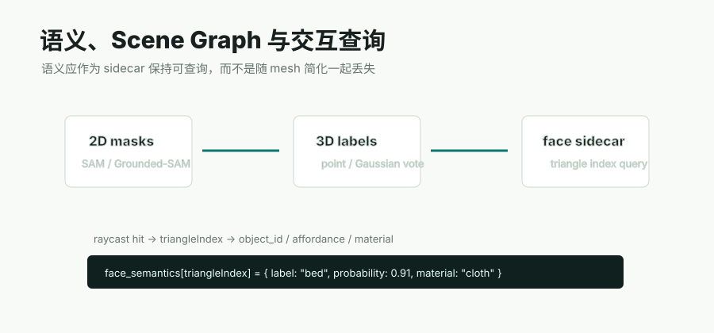

# 语义与 Scene Graph 阶段

语义层要服务交互查询：点击到哪个 face、属于哪个 object、是什么材质、能不能移动、能不能抓取、和其他物体有什么关系。



## 主要项目和方法

| 项目 / 方法 | 简介 | 对 Video2Mesh 的作用 | 风险 |
|---|---|---|---|
| Segment Anything / SAM | 通用 2D mask 生成/提示分割 | 生成 object masks，支持视频帧中的对象区域 | 无语义类别，需要 detector/VLM 命名 |
| [SAM3 / SAM3.1](sam3.md) | Meta 的 promptable concept segmentation 模型，用文本、exemplar、点/框/mask 在图像和视频中检测、分割并跟踪开放词汇概念 | 可替代或增强 GroundingDINO+SAM2，给 Video2Mesh 提供带 identity 的 2D mask evidence | 权重 gated、CUDA 栈新；仍需相机/深度/多视角 fusion 才能进入 3D sidecar |
| GroundingDINO / Grounded-SAM | 文本提示驱动检测 + mask | 开放词汇发现床、桌、椅、窗帘等对象 | 边界和类别稳定性需多帧融合 |
| 2D-to-3D mask fusion | 将每帧 mask 投影/投票到 3D 点或 Gaussian | 生成 3D object masks、semantic/probability splats | 遮挡和深度误差会造成串色 |
| [Holi-Spatial](holi-spatial.md) | 从 raw video 自动生成 3DGS、2D masks、3D bbox、caption、grounding 和 spatial QA | 给 Video2Mesh 增加空间 QA benchmark 和语义空间 sidecar schema | 当前保留一份真实 DA3/SAM3/PGSR fresh run；VLM、caption 与官方 QA 仍未执行 |
| [SceneVerse++ / PQ3D / SpatialLM](sceneversepp-pq3d-spatiallm.md) | SceneVerse++ 中的 PQ3D 做 3D instance segmentation，SpatialLM 做 layout / object detection / structured indoor modeling | 接到 semantic sidecar、object bbox、scene graph 和 spatial QA 层，补结构化 3D scene understanding | 它们消费已有 `mesh.ply` / `metadata.json`，不是从视频生成 mesh 或 3DGS 的重建模型 |
| Semantic splats | 给 3DGS/point cloud 携带 object probability | 支持可视化、hover、语义筛选和 mesh 回灌 | 不等同于 mesh face 语义 |
| Mesh face sidecar | 按 triangle index 保存 label/probability/material/affordance | 点击 collider 后直接查 object_id 和交互属性 | mesh 简化/替换时需要重建索引或映射 |
| Scene graph / VLM relation QA | 物体关系、支撑关系、可交互属性推理 | 给 simulator asset bundle 补 affordance、support、material | VLM 输出必须可复核 |

## 推荐数据合同

```json
{
  "mesh": "colliders/scene_collision.glb",
  "face_semantics": [
    {
      "face": 1024,
      "object_id": "bed_01",
      "label": "bed",
      "probability": 0.91,
      "material": "cloth",
      "affordance": ["support", "sit_or_lie"]
    }
  ]
}
```

## 当前项目状态

本周已验证 P0 KDTree 语义回灌和 P1 ray projection debug 路线。P1 当前没有真实 2D masks，只能用 projected semantic point label masks 调试，因此串色明显，暂时不能作为生产级语义融合结果。下一步应接入真实 2D mask、深度可见性过滤和 face graph smoothing。
