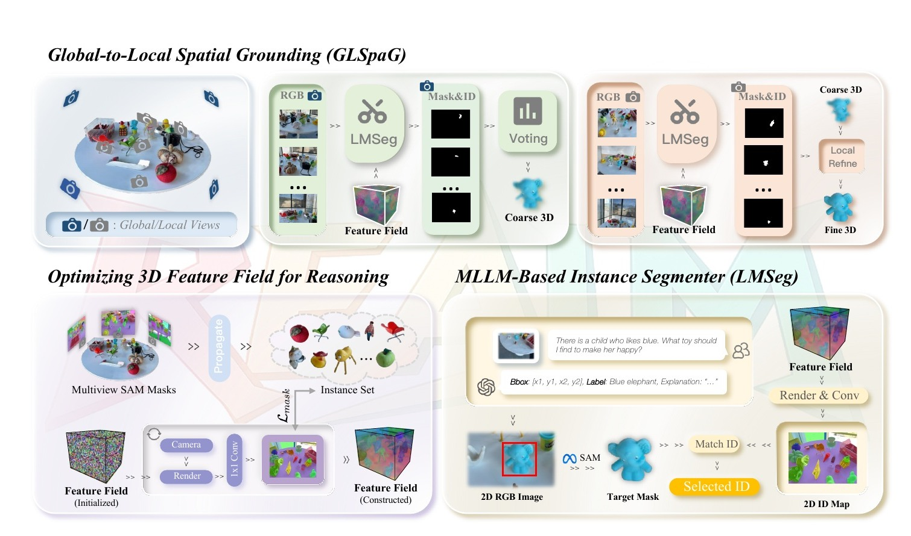
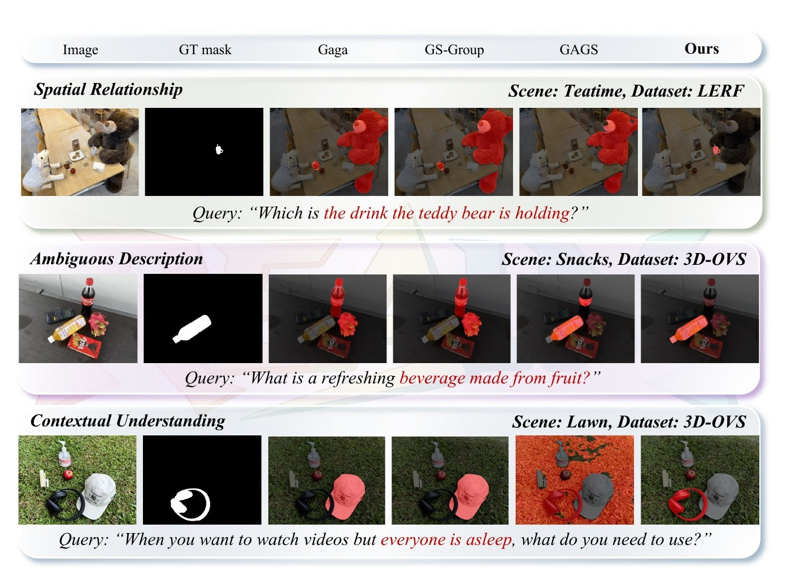
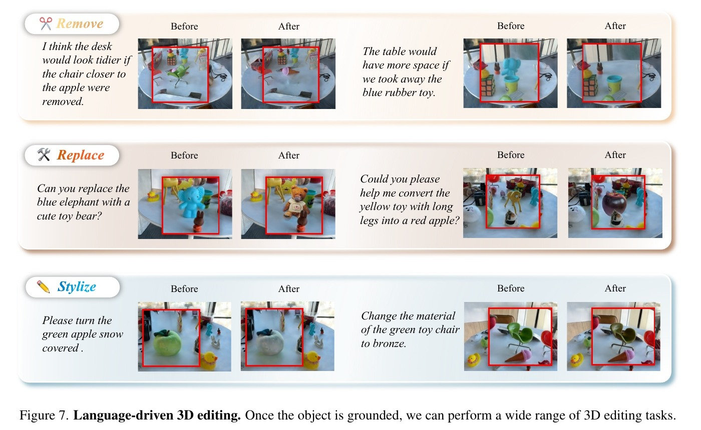

# REALM：面向隐式指令的 3D 推理分割与编辑



检查日期：2026-07-26

## 当前结论

REALM 解决的是比普通开放词汇分割更难的一层任务：用户不一定直接说出对象名称，而是通过空间关系、功能、常识或上下文提出隐式指令，例如“泰迪熊手里拿的饮料”或“大家都睡着时看视频需要什么”。方法利用已有 3DGS 渲染多个可理解的 RGB 视图，让 Qwen2.5-VL 负责推理、SAM 负责精细 2D mask，再通过一个跨视角一致的 Gaussian 实例特征场把答案落回 3D。

它对 Video2Mesh 的直接价值是补上 `semantic splats -> natural-language reasoning -> object_id` 这一层，使场景可以按复杂文本查询对象，并把查询结果交给 viewer、编辑器或 scene graph。它不负责从原始视频建立相机、训练高质量 3DGS、生成 mesh collider，也不证明语言驱动编辑已经具备几何或物理正确性。

本页状态为 **Paper audited / Local exact reproduction not tested**。文中的 mIoU、mBIoU、运行时间和编辑效果均为论文报告，不是 Video2Mesh 本地实验结果。

## 链接

- Paper: https://arxiv.org/abs/2510.16410
- Project page: https://changyueshi.github.io/REALM/
- 本地源 PDF：`钱塘观潮申报书/djj-paper/2510.16410v3.pdf`

## 基本信息

| 项 | 内容 |
|---|---|
| 标题 | REALM: An MLLM-Agent Framework for Open World 3D Reasoning Segmentation and Editing on Gaussian Splatting |
| 版本 | arXiv:2510.16410v3，PDF 日期 2026-03-10 |
| 作者 | Changyue Shi、Minghao Chen、Yiping Mao、Chuxiao Yang、Xinyuan Hu、Jiajun Ding、Zhou Yu |
| 机构 | 杭州电子科技大学、北京大学 |
| 论文状态 | arXiv 预印本；本页未把它写成已同行评审会议/期刊论文 |
| 核心任务 | 对已有 3DGS 执行显式或隐式语言条件下的 3D 实例分割，并演示删除、替换和风格迁移 |
| 主要模型 | 3DGS、SAM、跨视角实例传播、Qwen2.5-VL、Gaussian instance feature field |

## 任务定义

传统 LangSplat、GAGS、Gaussian Grouping 等方法擅长处理 `cup`、`chair` 这类显式名词查询。REALM 增加了三类推理：

| 查询类型 | 论文示例 | 所需能力 |
|---|---|---|
| 空间关系 | 泰迪熊手里拿的饮料是什么 | 同时识别多个物体并理解相对关系 |
| 模糊描述 | 什么是由水果制成的清爽饮料 | 从功能或属性推断目标类别 |
| 上下文理解 | 大家睡着时想看视频，需要使用什么 | 结合场景内容和常识选择对象 |

输出不是 3D bbox，而是与 Gaussian 实例身份对齐的精细 3D mask。对象定位完成后，论文再把该 mask 交给删除、替换和风格迁移操作。



## Pipeline

```text
multi-view RGB + calibrated cameras
  -> train / obtain a high-quality 3DGS scene
  -> SAM masks on input views
  -> temporal propagation associates cross-view instance IDs
  -> optimize per-Gaussian instance feature + classifier
  -> render diverse global views
  -> Qwen2.5-VL reasons query and predicts box/category/rationale
  -> SAM converts box to target mask
  -> intersect target mask with rendered instance-ID map
  -> vote target object ID across global views
  -> render close local views and refine the 3D mask
  -> query result / object editing
```

| 组件 | 输入 | 输出 | 论文中的作用 | 不负责什么 |
|---|---|---|---|---|
| Base 3DGS | 多视图图像、相机、初始化几何 | 可渲染 Gaussians | 提供高保真、可从新视角观察的场景代理 | 语言推理、碰撞或物理属性 |
| SAM + temporal propagation | 训练视图 | 跨视角一致的 instance masks / IDs | 为每个 Gaussian 建立实例身份监督 | 开放世界常识推理 |
| 3D feature field + classifier | Gaussian + 2D instance-ID maps | per-Gaussian instance feature / ID | 在任意视角渲染一致的 2D ID map | 类别名称和关系语义 |
| LMSeg | RGB render + query | box、category、rationale、SAM mask、target ID | 在单一视角完成图像级推理与实例匹配 | 多视角稳定性 |
| Global stage | 多个全局视角的 target IDs | 投票后的 coarse 3D mask | 降低随机视角遮挡和歧义 | 精细边界 |
| Local stage | 目标可见的局部视角和 2D masks | refined 3D mask | 通过 50 次局部优化改善边界 | 新几何生成 |
| Editing demo | target mask + scene | removal / replacement / stylization | 展示语言驱动对象级操作 | collider、动力学或编辑定量评测 |

## Global-to-Local Spatial Grounding

REALM 不把大量视图一次性塞给 MLLM，而是显式管理视角：

1. 对训练相机做 K-means，论文默认 `N_cluster = 24`。
2. 统计每个代表视角中可见 instance ID 的数量，选择覆盖实例最多的 `N_global = 8` 个视角。
3. 每个全局视角独立运行 LMSeg，再对 target instance ID 投票。
4. 从能看见该 target ID 的相机中选局部视角。
5. 将 coarse 3D mask 渲染到局部视图，与 LMSeg 的局部 2D mask 做 L1 对齐，默认优化 50 步。

消融显示，过多局部优化会把 3D mask 过拟合到少量局部视角：50 步最好，500/1000 步反而下降。这说明该方法仍受视角覆盖、2D mask 质量和局部优化范围约束。

## 论文结果

### 隐式查询分割

| 方法 | LERF mIoU / mBIoU | 3D-OVS mIoU / mBIoU | REALM3D mIoU / mBIoU |
|---|---:|---:|---:|
| Gaga | 44.82 / 42.37 | 42.53 / 37.38 | 58.56 / 49.65 |
| GAGS | 17.84 / 15.87 | 58.46 / 50.34 | 52.24 / 39.76 |
| GS-Group | 42.43 / 40.01 | 41.79 / 38.28 | 65.55 / 55.99 |
| REALM | **92.88 / 90.12** | **93.68 / 86.02** | **82.30 / 70.37** |

这些数字来自论文 Table 1。REALM3D 报告约 100 个场景和 1444 个 prompt-mask pairs；论文正文概括为 100+ scenes / 1K+ pairs。

### 运行与渲染

| 阶段 | 论文报告时间 |
|---|---:|
| Global MLLM calls | 2.53 s |
| Local MLLM calls | 2.48 s |
| Local refinement | 3.67 s |
| Total | 8.68 s |

MLLM 视角调用可并行。论文还报告单通道 mask 渲染为 354.72 FPS；该值是渲染速度，不是端到端查询吞吐。

### 编辑演示



删除、替换和风格迁移的价值在于证明 target mask 可以驱动下游工具。论文没有给出 mesh 完整性、碰撞、遮挡一致性或物理真实性指标，因此不能把这些图当作 simulator-ready 编辑证据。

## Benchmark 与证据风险

- LERF / 3D-OVS 的隐式 prompt 由 Qwen2.5-VL 生成后人工筛选，REALM3D 的 prompt-mask pairs 也大量借助 Qwen2.5-VL 和 SAM 构造；方法推理阶段再次使用同类模型，可能带来模型偏向。
- REALM3D 提供了更大的隐式查询基准，但本文仍是预印本，本页没有核对公开数据下载、代码许可证或完整复现实验。
- 编辑只做定性展示，方法创新的核心仍是 reasoning segmentation，而不是通用 3D 编辑器。
- 依赖已有多视图 3DGS、相机和跨视角 instance field。上游几何、mask 或 instance association 出错时，MLLM 推理正确也无法得到干净的 3D mask。

## 在 Video2Mesh 中的位置

```text
Video2Mesh-owned geometry and semantics
  frames + cameras + clean visual 3DGS
  + per-frame masks / object identities
  + semantic splats / object sidecar
            |
            v
REALM-style reasoning layer
  rendered global views
  -> MLLM reasoning
  -> object_id vote
  -> local mask refinement
            |
            v
query result sidecar / viewer selection / guarded editing command
```

推荐输出独立的查询 sidecar，而不是直接改写 visual PLY：

```json
{
  "query": "离红苹果更近的玩具椅在哪里？",
  "object_id": "chair_red_01",
  "confidence": 0.94,
  "evidence_views": ["frame_0012", "frame_0031"],
  "rationale": "selected by spatial relation",
  "source": "realm_style_reasoning"
}
```

## 官方 Pipeline 与本地状态

| REALM 阶段 | Video2Mesh 当前对应 | 状态 |
|---|---|---|
| 高质量多视图 3DGS | GraphDECO / PGSR visual PLY | Reused |
| 2D masks | GroundingDINO + SAM2、SAM3/Holi-Spatial evidence | Reused |
| 跨视角 instance feature field | 当前以 object IDs、semantic PLY/sidecar 为主，没有训练 REALM feature classifier | Proxy |
| Qwen2.5-VL LMSeg | 尚未按 REALM prompt contract 和 multi-view vote 接入 | Not tested |
| 24-cluster / 8-global view selection | 当前 `svlgaussian` 选帧协议不同，不等价 | Not tested |
| Local 3D mask refinement | 现有 probability backprojection / smoothing 不是 REALM local loss | Proxy |
| REALM3D benchmark | 未下载、未评测 | Not tested |
| 删除、替换、风格迁移 | 现有 object split / completion / viewer 工具不等价 | Not tested |

## 接入判断

- P1：先做只读 reasoning query，不自动修改场景。让 MLLM 返回 `object_id + evidence views + rationale`，再用已有 semantic sidecar 选中对象。
- P1：对同一隐式 query 运行多视角投票，记录每视角的 bbox、mask 和 target ID，人工检查是否稳定。
- P2：只有在 object identity field 和局部 mask refinement 可验证后，才尝试对象删除或替换。
- 不替代：COLMAP/PGSR/GraphDECO 几何、mesh collider、object completion、physics sidecar 和 simulator adapter。
- 风险：MLLM 幻觉、视角选择偏差、跨视角 ID 错配和 SAM 边界错误会沿 3D feature field 放大；所有编辑命令都应保留可回滚的原始 visual/collider 资产。
