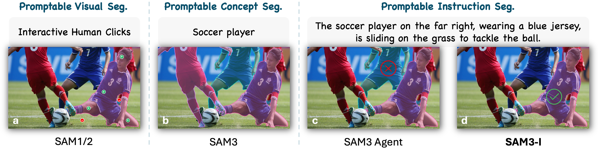
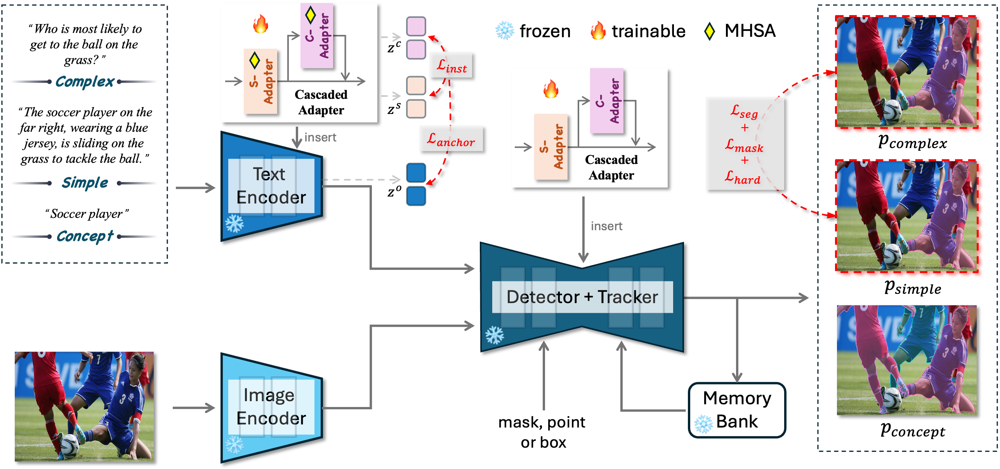
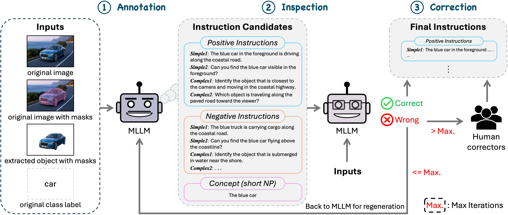

# SAM3-I：用自然语言指令做实例分割



## 结论先行

SAM3-I 最有价值的变化不是提升普通 `bed`、`lamp` 这类概念分割，而是把 SAM3 从短 noun phrase 扩展到 **属性、位置、关系、功能和隐式推理共同约束的实例指令**。例如，SAM3 适合找出所有 `soccer player`，SAM3-I 的目标则是只分割“最右侧、穿蓝色球衣、正在铲球的运动员”。

对 Video2Mesh，推荐把它放在 `semantic-scene-graph` 的 **P1 指令分割实验分支**：替换 `复杂指令 -> Qwen 拆成短词 -> SAM3 多轮 mask 过滤`，直接输出目标 2D mask，再进入现有相机、深度、跨视角融合和 semantic sidecar 链路。它不输出 3D 几何、位姿、object-local 到 room-world 变换、mesh、collider、scene graph 或 physics sidecar。

当前不建议直接并入默认主链路，原因有四个：

1. v4 结果很强，但主要证据来自作者构建的 HMPL-Instruct；RefCOCO 上仍低于 UniPixel。
2. 论文训练使用 16 张 H100，数据引擎使用 32 张 H100，个人复训成本高。
3. 官方仓库的 checkpoint 和 annotation JSON 依赖 Google Drive，SAM3 底座还依赖 gated Hugging Face 权重。
4. GitHub 没有顶层许可证，仓内 `pyproject.toml` 声称 MIT 并引用一个不存在的 `LICENSE`，商用和再分发边界不清楚。

## 本页核验口径

| 层 | 状态 | 证据与边界 |
|---|---|---|
| 论文身份与内容 | **Passed** | 逐页读取并渲染用户提供的 `2512.04585v4.pdf`，18 页完整；方法图、Table 1-8 和附录可读 |
| ar5iv 页面 | **Reused / 版本滞后** | ar5iv HTML 可访问，但内容仍是较早版本的 PACO-LVIS-Instruct 初步实验；本页指标以 v4 PDF 为准 |
| 官方代码审计 | **Passed** | 审计 `debby-0527/SAM3-I` 默认分支 commit `5656d47`；检查 README、训练/评测脚本、Hydra 配置、adapter 与 loss 实现 |
| 静态代码验证 | **Passed** | Python 3.12 下 146 个 `.py` 文件通过 AST 解析；shell 入口通过 `bash -n`；`predictions.json` 2,830 条记录可解析；package wheel 可构建 |
| checkpoint / 数据下载 | **Blocked** | 官方 Google Drive 链接存在，但当前网络访问超时；没有下载 Stage 3 checkpoint 或 HMPL-Instruct annotation JSON |
| 本地或远端推理 | **Not tested** | 本次没有安装完整 CUDA 环境，也没有运行 SAM3-I checkpoint；下文没有新鲜 bedroom_4 指标或截图 |
| 许可证 | **Blocked** | GitHub API `license=null`，仓库没有 `LICENSE`；论文只把 HMPL-Instruct 限定为学术研究，明确不面向商业部署 |

## 官方入口与版本

- 论文 v4：https://arxiv.org/abs/2512.04585
- 用户提供的 PDF：`/Users/zhangyuxiang/Desktop/worksplace/PaperReading/SAM3-I/2512.04585v4.pdf`
- ar5iv HTML：https://ar5iv.labs.arxiv.org/html/2512.04585
- 官方代码：https://github.com/debby-0527/SAM3-I
- SAM3 底座：https://github.com/facebookresearch/sam3
- SAM3 Hugging Face：https://huggingface.co/facebook/sam3

| 项 | 核验结果 |
|---|---|
| 论文 | *SAM3-I: Segment Anything with Instructions* |
| arXiv | `2512.04585v4`；v1 提交于 2025-12-04，v4 修订于 2026-04-16 |
| 作者 | Jingjing Li、Yue Feng、Yuchen Guo、Jincai Huang、Wei Ji 等 13 人 |
| 任务 | Promptable Instruction Segmentation（PIS） |
| 底座 | SAM3，原始 backbone 冻结 |
| 作者仓库 citation | README 按 ACL 2026 proceedings 给出 BibTeX；本页未把它当作已独立核验的正式收录状态 |
| 代码快照 | `main@5656d47bef4f48f9b1952b2a30cde9594b3f7d39`，最后 push 2026-04-14 |
| GitHub 状态 | 2026-08-02 检查时 176 stars、14 forks、2 个 open items；无 release、无 tag、GitHub 未识别许可证 |

## SAM3-I 解决什么问题

SAM3 的 Promptable Concept Segmentation（PCS）以短概念为核心，例如 `yellow bus` 或 `soccer player`，会返回所有符合概念的实例。复杂指令通常要借助外部 MLLM：先把长句改写成一个或多个短 noun phrase，再让 SAM3 预测候选，最后由 MLLM 反复检查和过滤 mask。

这个 agent pipeline 有两个结构性问题：

- 长指令被压缩成短词后，属性、数量、相对位置、动作和功能条件容易丢失。
- 同一 MLLM 至少承担改写与检查，多轮调用增加模型规模、时延、依赖和失败点。

SAM3-I 定义三级提示层次：

| 层级 | 示例 | 需要的能力 |
|---|---|---|
| Concept | `soccer player` | 找到概念对应的所有实例，兼容 SAM3 PCS |
| Simple | `the soccer player on the far right, wearing a blue jersey` | 目标名仍存在，同时解析属性、位置和局部关系 |
| Complex | `who is most likely to get to the ball on the grass?` | 不出现目标名，通过动作、功能、affordance 或上下文推断目标 |

这使同一个模型能接受短概念和长指令，并按论文设定保持 SAM3 原有 concept branch 不变。

## 模型结构



SAM3-I 冻结 SAM3 backbone，把级联适配器插入文本编码器与 detector：

| 组件 | 作用 | 论文 / 代码细节 |
|---|---|---|
| S-Adapter | simple instruction grounding | 学习类别、属性、位置和关系；目标 noun phrase 仍明确出现 |
| C-Adapter | complex instruction reasoning | 接在 S-Adapter 后，处理不出现目标名的功能、动作和上下文推理 |
| Text encoder adapter | 改写文字特征 | 每个 Transformer block 中作为 parallel residual module |
| Detector adapter | 把指令语义传播到 mask | 插入 multimodal decoder transformer 和 pixel decoder / FPN 连接 |
| Bottleneck | 控制新增参数 | down-project 到 64 维，GELU，再 up-project 回原维度 |
| MHSA | 建模长程文字依赖 | feature dimension 1024，4 个 attention heads |

新增可训练参数约 `311.9M`（约 0.3B），总模型从 SAM3 的 0.8B 增至 1.1B。它明显小于 `SAM3 0.8B + Qwen3-VL-8B` 的 8.8B agent 组合，但“参数更少”不等于已证明端到端延迟更低：论文没有给具体 FPS、显存或 wall-clock inference 数据。

### 四类对齐目标

v4 的训练目标比早期 ar5iv 缓存更完整：

| Loss | 作用 |
|---|---|
| `L_seg` | 继承 SAM3 的检测与 mask 监督 |
| `L_inst` | 让同一实例的 simple / complex instruction embedding 接近，同时保留同概念不同实例的区分度 |
| `L_anchor` | parent-rank concept anchoring：指令应更接近自己的父概念，而不是其他概念 |
| `L_mask` | 对齐 simple / complex 分支的 mask distribution，减少语义漂移 |
| `L_hard` | 用两分支分歧定位难区域，对遮挡、关系和上下文区域加权监督 |

训练按语言难度递进：Stage 1 只学 simple，Stage 2 在其基础上学 complex，Stage 3 联合开启全部适配器和对齐目标。完整模型在 simple / complex 上达到 `59.7 / 49.0 gIoU`；单一 adapter、取消 curriculum 或去掉任一类对齐目标都会下降。

## HMPL-Instruct 数据引擎



论文以 PACO-LVIS 为底，生成 HMPL-Instruct。主数据引擎分三步：

1. Qwen3-VL-8B 根据原图、mask overlay、目标 crop 与类别生成 concept、simple、complex 和 negative instructions。
2. 另一个 Qwen3-VL-8B 做多选式一致性检查；候选必须 100% 通过，否则最多回炉 10 次。
3. 自动流程仍失败的样本交给三位人工标注者修改或删除。

one-to-many 不能只靠自动生成，因为一句话要对应同类实例的某个子集。作者因此额外提供双栏 Web 标注工具：左侧在 mask overlay 上点选目标实例，右侧保留 clean reference，人工同时写含目标名的 referring description 和不含目标名的 reasoning description。

### 数据规模

| 项 | v4 论文数字 |
|---|---:|
| 图像 | 44,109 |
| object-level masks | 133,960 |
| part-level masks | 213,160 |
| masks 合计 | 347,120 |
| positive instructions | 849,792 |
| 平均指令长度 | 15 words |
| one-to-many 样本 | 2,941 |
| one-to-many masks | 7,449 |
| one-to-many paired instructions | 11,764 |

数据包含 concept / simple / complex、object / part，以及 one-to-one / one-to-many / one-to-all。论文自己也承认 one-to-many 数量仍偏少，可能限制 group-level 或 collective reasoning 泛化。

## v4 论文结果

### 与 SAM3 Agent 对比

在 HMPL-Instruct 上，SAM3-I 保持原 SAM3 concept 分数，同时大幅超过 Qwen3-VL-8B agent：

| 模型 / 指令 | gIoU | P@50 | 相对 agent |
|---|---:|---:|---:|
| SAM3 concept | 29.5 | 31.9 | - |
| SAM3-I concept | 29.5 | 31.9 | 保持不变 |
| SAM3 Agent simple | 28.4 | 28.9 | baseline |
| SAM3-I simple | **59.7** | **65.3** | **+31.3 / +36.4** |
| SAM3 Agent complex | 26.4 | 27.4 | baseline |
| SAM3-I complex | **49.0** | **51.0** | **+22.6 / +23.6** |

这个结果支持“直接 instruction grounding 优于长指令改写成短 noun phrase 再筛 mask”。但 HMPL-Instruct 同时由作者构建并用于训练/评测，所以它证明的是方法在目标分布上的有效性，不是独立第三方验证。

### 目标数量和外部 benchmark

| 场景 | SAM3-I gIoU / P@50 | 判断 |
|---|---:|---|
| simple one-to-one | 60.8 / 66.7 | 最强、接近主结果 |
| simple one-to-many | 48.9 / 50.0 | 明显下降，符合样本较少的风险 |
| simple one-to-all | 60.9 / 67.8 | 恢复到较高水平 |
| complex one-to-one | 48.1 / 49.6 | 可用但弱于 simple |
| complex one-to-many | 39.9 / 39.5 | 当前最难设置 |
| complex one-to-all | 54.7 / 58.7 | 比 one-to-many 稳定 |

外部数据上，SAM3-I 在 RefCOCO 为 `76.3 gIoU / 85.5 P@50`，低于 UniPixel 的 `78.1 / 88.4`；在推理型 Ref-ZOM 为 `73.6 / 80.0`，高于 UniPixel 的 `67.0 / 72.4`。这说明它的优势更集中在隐式推理，而不是所有 referring segmentation 指标都领先。

object / part 汇总上，SAM3-I 分别达到 `66.6 / 72.2` 与 `47.2 / 50.0`，显著高于 UniPixel 的 `42.5 / 45.4` 与 `23.4 / 17.5`。不过论文没有给 Video2Mesh 最关心的视频 identity consistency、多帧 mask drift、2D-to-3D semantic coverage 或 room-scale runtime 指标。

## 官方代码审计

官方仓库不是只放一段 demo，主要表面完整：

```text
run.sh
  -> install
  -> train: scripts/train.sh + Hydra configs
  -> eval: scripts/eval.sh

sam3/sam3/train/configs/sam3i/
  -> base.yaml
  -> sam3i_1-1.yaml
  -> sam3i_1-2.yaml
  -> sam3i_3_all.yaml

scripts/
  -> inference.py: multi-GPU batch inference
  -> evaluate.py: gIoU / P@50

web_annotation_tool/
  -> dual_panel_instruction_anno_tool-EN.html
```

### 已确认的可复现要素

- Stage 1 / 2 / 3 的 config、checkpoint 接力和 loss 开关已公开。
- `eval.sh` 固定跑 HMPL 三级目标数量、RefCOCO 与 Ref-ZOM 的 8 个任务组合。
- inference 使用 CUDA autocast `bfloat16`，默认 batch 32，默认 8 GPU。
- `model_builder.py` 能从 `facebook/sam3` 下载 base checkpoint，也能装载本地 Stage 3 checkpoint。
- 仓库附带 2,830 条 `predictions.json`，字段包括 image、prompt、prompt type 和 mask predictions。
- 双栏标注工具是单 HTML，可在 Chrome 中加载左右文件夹、点选实例、自动保存并导出 JSON。

### 工程缺口

| 问题 | 影响 |
|---|---|
| 没有顶层 `LICENSE` | 不能把“GitHub 可见”直接等同于可自由使用或再分发 |
| `pyproject.toml` 写 `license={file="LICENSE"}` 与 MIT classifier，但文件不存在 | 包元数据与仓库实际许可证冲突 |
| `requires-python >=3.8`，但源码使用 Python 3.12 才支持的 f-string 语法 | 本机 Python 3.9 解析失败；Python 3.12 解析通过，实际前置条件应收紧 |
| `run.sh install` 不安装 `torch` / `torchvision` | 用户必须先准备匹配 CUDA 的 PyTorch 环境，README 没有给确定版本矩阵 |
| 源码归档 279 个文件中含 101 个 `.pyc` 和 `*.egg-info` | 仓库卫生较差，也掩盖了真正源文件范围 |
| 没有 test suite、CI、release 或 tag | “one-click reproduces all paper results” 仍依赖外部数据、权重、CUDA 和未验证脚本 |
| checkpoint / annotation JSON 放在共享 Google Drive folder | 版本、hash、文件级 manifest 与长期可用性不足 |
| 没有报告 inference 显存与速度 | 1.1B 单阶段模型能否在 RTX 3090 24GB 稳定运行仍需实测 |

因此更准确的状态是：**代码结构和配置已公开，静态可读；完整复现仍被权重/数据下载、SAM3 gated access、环境版本和许可证阻塞。**

## 软件与硬件成本

| 环节 | 论文 / 代码口径 | 对本项目的意义 |
|---|---|---|
| 数据生成与检查 | 32 x NVIDIA H100，两个 Qwen3-VL-8B | 不适合为第一次 PoC 重新生成全量数据 |
| 模型训练 | 16 x NVIDIA H100，batch size 32 | 完整复训成本高；应先用 Stage 3 checkpoint |
| 官方训练 launcher | 默认 8 GPU / node，NCCL，bf16 | Mac 不可运行；RTX 3090 集群需验证 bf16、PyTorch、CUDA 和显存 |
| base 权重 | Hugging Face `facebook/sam3` | gated access 与 SAM License 是前置门槛 |
| SAM3-I 权重 / 标注 | Google Drive | 当前未下载，必须先固化文件清单、大小和 SHA-256 |

## 在 Video2Mesh 中的位置

推荐的数据流是：

```text
selected frames / video clip
  + instruction candidates from user, VLM, or scene contract
  -> SAM3-I image instruction segmentation
  -> 2D masks + scores + prompt provenance
  -> temporal association / tracker audit
  -> camera + depth / mesh visibility filtering
  -> multi-view 2D-to-3D semantic fusion
  -> semantic splats / object point clouds / mesh face sidecar
  -> scene graph relation candidates
```

SAM3-I 的输出必须继续被标为 **2D mask evidence**。即使一句指令包含 `left of the bed`、`used for holding drinks` 或 `closest to the window`，模型预测也不是可审计的 3D relation truth；关系要在相机与房间坐标里重新验证。

### 适合替换的环节

| 当前做法 | SAM3-I 候选做法 | 预期收益 |
|---|---|---|
| Qwen 生成多个 noun phrases，再分别跑 SAM3 | 直接把结构化自然语言指令交给 SAM3-I | 少一次 prompt collapse，减少多轮 MLLM 过滤 |
| 单独用 box / phrase 区分相似物体 | 用属性、位置和功能写成 simple / complex instruction | 更适合床头柜、枕头、窗扇等同类实例消歧 |
| 多个 SAM3 mask 由规则 union / reject | SAM3-I 先给 instance-specific mask，再由现有 QA gate 审核 | 降低误并相邻实例的概率，但不能取消几何 QA |

### 不能替换的环节

- 不替代 SAM3.1 的已验证视频多物体跟踪；论文没有提供 video benchmark。
- 不替代 DA3 / COLMAP / PGSR 的相机、深度、点云或 3DGS。
- 不直接生成 semantic 3DGS、mesh face semantics、object bbox 或 scene graph。
- 不生成 closed object mesh、room alignment、collider、质量、摩擦、关节或 simulator bundle。

## 最小接入实验

建议先做 `bedroom_4` 的小规模 A/B，而不是复训：

1. 从已有连续 8 帧组件 mask 中选 20-30 个目标，覆盖床头柜、中央白枕头、左右台灯、窗扇、盆栽和床组件。
2. 为每个目标写 concept / simple / complex 三类指令；complex 不出现目标 noun phrase。
3. 对比三条路线：原 SAM3 phrase、`Qwen -> SAM3` agent、SAM3-I Stage 3。
4. 逐帧计算 gIoU / P@50、空 mask 率、相邻实例泄漏、跨帧 mask IoU 和 object association 稳定性。
5. 只把通过 2D QA 的 mask 送入现有 DA3 / camera / depth fusion；再比较 3D semantic coverage、串色和 bbox drift。
6. 保存 checkpoint hash、SAM3 base revision、CUDA/PyTorch 版本、prompt、阈值和每帧输出，不把 paper checkpoint 结果写成 Video2Mesh 本地完成结果。

### Go / No-Go 门槛

| Gate | 建议条件 |
|---|---|
| 访问与许可证 | SAM3 与 SAM3-I 权重可合法下载；用途与再分发条款完成审查 |
| 运行 | 单卡 24GB 或既定多卡环境可稳定处理目标分辨率，不 OOM |
| 2D 指令分割 | simple / complex 均超过当前 Qwen+SAM3 baseline，且空 mask / 泄漏率不恶化 |
| 多帧一致性 | 逐帧 instruction masks 能被现有 association 稳定连接，或有可验证 tracker 路线 |
| 3D fusion | semantic coverage 提升且 wall/floor/相邻物体串色不增加 |
| Provenance | 每个 3D label 能回溯到 frame、instruction、mask、score、model revision |

## 风险与边界

- **同源 benchmark 风险**：HMPL-Instruct 是作者构建、训练和主评测的数据，强增益需要第三方场景复核。
- **one-to-many 仍弱**：complex one-to-many 只有 `39.9 gIoU / 39.5 P@50`，正是室内多个相似杯子、枕头、窗扇常见的情况。
- **视频能力未证明**：图中保留 tracker / memory bank 不等于 instruction-conditioned video identity 已有 benchmark 证据。
- **2D 关系不是 3D 关系**：`left`、`near`、`behind` 可能依赖当前视角，不能直接写入 room-coordinate scene graph。
- **语义幻觉**：complex instruction 依赖功能和常识，可能把“用来坐的物体”错落到视觉相似但不符合场景状态的实例。
- **数据许可**：论文写明 HMPL-Instruct 仅供学术研究且不面向商业部署；代码仓许可证又缺失。
- **基础模型依赖**：SAM3 权重 gated，SAM License 不是 MIT/Apache；SAM3-I 仓内的 MIT classifier 不能覆盖上游权重条款。
- **版本漂移**：ar5iv 缓存与 v4 PDF 的数据规模、loss 和指标不同；实验必须锁定 `2512.04585v4` 与代码 commit。
- **资源成本**：H100 训练规模不能直接外推到 RTX 3090；官方没有给推理显存与速度。

## 最终判断

SAM3-I 值得进入 Video2Mesh 的 P1 技术储备，优先服务 **同类实例消歧和复杂自然语言到 2D mask**。它比当前 `Qwen 拆词 + SAM3 + 多轮过滤` 更直接，v4 在 reasoning-heavy Ref-ZOM 和作者的 HMPL-Instruct 上也给出有说服力的增益。

但它不是语义 3D 重建模型，更不是 mesh、collider 或 physics 生成器。当前最合理的动作是先解决 checkpoint、SAM3 access 和许可证，再在 `bedroom_4` 上做 20-30 个指令的 A/B。只有 2D、跨帧和 3D fusion 三层都通过，才考虑把 SAM3-I 从实验 backend 升级为默认 mask evidence 分支。

## 参考资料

- [SAM3-I arXiv v4](https://arxiv.org/abs/2512.04585)
- [SAM3-I official code](https://github.com/debby-0527/SAM3-I)
- [SAM3 official repository](https://github.com/facebookresearch/sam3)
- [SAM3 / SAM3.1 在 Video2Mesh 中的调研与实测边界](sam3.md)
- [Holi-Spatial 调研与 fresh run](holi-spatial.md)
