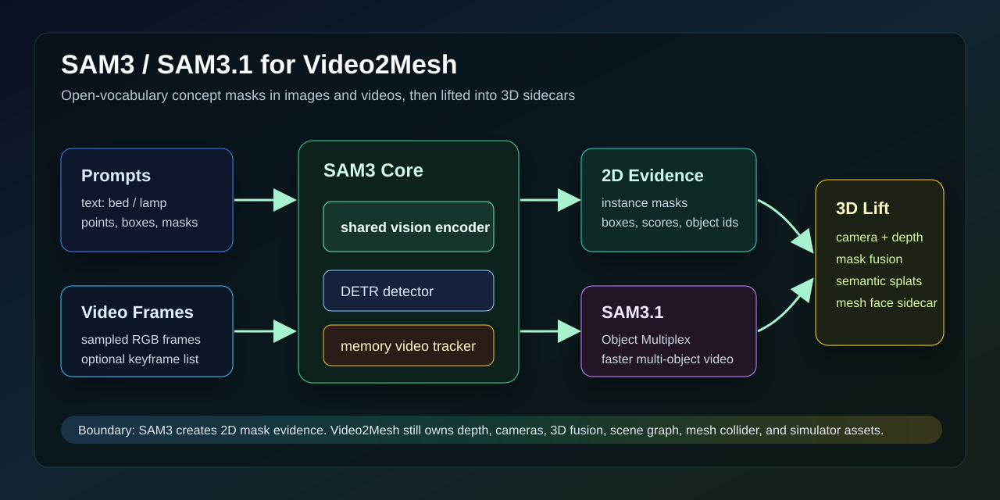

# SAM3 / SAM3.1 调研



## 链接

- Meta research page: https://ai.meta.com/research/sam3/
- Meta blog: https://ai.meta.com/blog/segment-anything-model-3/
- GitHub: https://github.com/facebookresearch/sam3
- SAM3.1 release notes: https://github.com/facebookresearch/sam3/blob/main/RELEASE_SAM3p1.md
- Paper: https://arxiv.org/abs/2511.16719
- Hugging Face SAM3: https://huggingface.co/facebook/sam3
- Hugging Face SAM3.1: https://huggingface.co/facebook/sam3.1
- Transformers docs: https://huggingface.co/docs/transformers/main/en/model_doc/sam3

## 基本信息

| 项 | 内容 |
|---|---|
| 论文标题 | SAM 3: Segment Anything with Concepts |
| arXiv | 2511.16719v2, v1 2025-11-20, v2 2026-03-28 |
| 发布方 | Meta Superintelligence Labs / Meta AI |
| 核心任务 | Promptable Concept Segmentation: 用短文本、image exemplar 或视觉 prompt 找到所有匹配实例并输出 masks / identities |
| 官方模型 | `facebook/sam3`, `facebook/sam3.1` |
| 权限状态 | Hugging Face gated/manual access；需要先申请并登录 HF token |
| 许可证 | SAM License，不是 MIT/Apache；使用、再分发和用途限制要单独审查 |
| 官方 GitHub 状态 | `facebookresearch/sam3`，默认分支 `main`，2026-06-15 仍有更新；本次调研时约 10.9k stars / 1.7k forks |

## 核心结论

SAM3 的定位和 SAM/SAM2 不一样：它不是只在给定点/框附近抠一个 mask，而是把“概念”作为一等输入，能在图像或视频里把短文本、exemplar、点、框、mask 对应的所有实例找出来、分割出来并保持 identity。对 Video2Mesh 来说，SAM3 最有价值的位置是 **开放词汇 2D mask evidence 层**，它可以替代或增强当前 `GroundingDINO -> SAM/SAM2` 的组合。

它不应该被写成 3D 语义真值或几何模块。SAM3 输出仍是 2D masks、boxes、scores、object identities；要变成 Video2Mesh 可用的 semantic splats、mesh face sidecar、object bbox 或 scene graph，还必须依赖相机位姿、深度/mesh 可见性过滤、多视角融合和 QA。

## 方法拆解

SAM3 把检测和跟踪拆开，但共享一个视觉编码器：

| 组件 | 输入 | 输出 | 作用 | 不能误解成 |
|---|---|---|---|---|
| Concept prompt | 短 noun phrase、image exemplar、点/框/mask | prompt embedding / condition | 描述要找的实例集合，比如 `bed`, `window curtain`, `lamp` | 自动生成完整 scene graph |
| Shared vision encoder | image/video frames | visual features | 给图像检测和视频跟踪共用视觉表征 | 3D feature field |
| DETR-style detector | visual features + text/geometry/exemplar prompt | boxes, masks, scores, presence | 在单帧或 keyframe 中找所有匹配概念实例 | GroundingDINO 完全等价替代品 |
| Presence head | prompt/image pair | existence / discrimination signal | 区分相近文本，例如颜色、状态、角色差异 | 语义关系推理器 |
| Memory video tracker | frames + initialized objects + corrections | per-frame masks and object identities | 把已发现对象沿视频传播，并支持交互修正 | 相机跟踪或 SLAM |
| SAM3.1 Object Multiplex | 多个 tracked objects | joint tracking outputs | 把多物体跟踪放到共享 memory/bucket 里，减少重复计算 | 新任务定义或新 3D 输出 |

官方 README 写明 SAM3 有约 848M 参数，detector 是 DETR-based，tracker 继承 SAM2 的 transformer encoder-decoder 思路。论文摘要还强调它的 SA-Co 数据和 benchmark 覆盖 270K unique concepts，数据引擎标注了 4M unique concept labels。

## Pipeline

```text
Video2Mesh frames
  -> sampled keyframes / selected video clip
  -> prompt list from class vocabulary, VLM, or user text
  -> SAM3 image detector for concept instances
  -> SAM3/SAM3.1 video tracker for per-frame masks and object ids
  -> mask cleanup and temporal association audit
  -> camera + depth / mesh visibility filtering
  -> 2D-to-3D semantic fusion
  -> semantic splats / mesh face sidecar / object bbox
  -> scene graph and spatial QA
```

在 Holi-Spatial 里，SAM3 的角色更窄：VLM 先发现类别并维护 class-label memory，SAM3 再按 `image + label` 生成 2D instance masks，后续由 DA3/PGSR depth、camera、mesh-guided filtering 和 bbox postprocess 处理 3D lifting。也就是说，Holi-Spatial 不是让 SAM3 直接输出 3D bbox，而是把 SAM3 当作 2D mask generator。

## 输入与输出

| 场景 | 输入 | 输出 |
|---|---|---|
| image segmentation | image + text prompt / box / point / mask / exemplar | `masks`, `boxes`, `scores` |
| video segmentation | JPEG folder 或 MP4 + text/visual prompt + frame index | per-frame outputs, object ids, masks |
| batch inference | 多张 image + prompt list | batch masks / boxes / scores |
| SAM3 agent | 复杂文本 prompt | 由 agent 拆 prompt 后调用 SAM3 工具 |

官方 README 的最小 image 用法是：

```python
from PIL import Image
from sam3.model_builder import build_sam3_image_model
from sam3.model.sam3_image_processor import Sam3Processor

model = build_sam3_image_model()
processor = Sam3Processor(model)
image = Image.open("<YOUR_IMAGE_PATH.jpg>")
state = processor.set_image(image)
output = processor.set_text_prompt(state=state, prompt="<YOUR_TEXT_PROMPT>")
masks, boxes, scores = output["masks"], output["boxes"], output["scores"]
```

视频入口则使用 `build_sam3_video_predictor()`，先 `start_session`，再在某个 frame 上 `add_prompt`。SAM3.1 的 notebook 展示的是同一任务表面下的 Object Multiplex 多物体跟踪。

## SAM3 与 SAM / SAM2 / Grounded-SAM 的区别

| 路线 | 最强能力 | 对 Video2Mesh 的意义 | 主要短板 |
|---|---|---|---|
| SAM v1 | 点/框 prompt 的高质量 image mask | 做交互式或 detector-box-driven 单帧 mask | 不命名，不负责视频 identity |
| SAM2 | 视频 object mask propagation | 从关键帧 mask 跟踪到整段视频 | 需要已有对象或 prompt，open-vocabulary discovery 较弱 |
| GroundingDINO + SAM | 文本检测框 + SAM mask | 当前工程里最稳的开放词汇 baseline | 两个模型串联，box 和 mask 错误会叠加 |
| SAM3 | text/exemplar/visual prompt 的 image+video concept segmentation | 一个模型同时做开放词汇检测、分割和视频跟踪 | 权重 gated，环境重，仍需 3D fusion 审计 |
| SAM3.1 | 更高效的多物体视频跟踪 | 大量 object masks / dense tracking 时更适合 | 官方性能主要以 H100 和公开 benchmark 报告，3090 上需实测 |

短期判断：Video2Mesh 不应该立刻删除 GroundingDINO/SAM2 路线。更稳妥的是把 SAM3 作为 P1 替代分支：同一组 `bedroom_4` frames、同一批 prompts，分别跑 Grounded-SAM2 与 SAM3，然后比较 mask coverage、跨帧 identity、2D-to-3D semantic coverage 和人工 QA。

## 模型、权重与环境

截至 2026-07-11 实测 API / 官方仓库信息：

| 项 | SAM3 | SAM3.1 |
|---|---|---|
| HF repo | `facebook/sam3` | `facebook/sam3.1` |
| 访问 | public repo, manual gated access | public repo, manual gated access |
| lastModified | 2025-11-20 | 2026-03-27 |
| 权重文件 | `model.safetensors`, `sam3.pt` | `sam3.1_multiplex.pt` |
| processor/tokenizer | `processor_config.json`, tokenizer files | 同样包含 processor/tokenizer files |
| 官方定位 | image + video concept segmentation | Object Multiplex checkpoint and optimized video inference |

官方 README 的推荐环境偏新：

| 层 | 官方要求 / 示例 |
|---|---|
| Python | README prerequisites 写 Python 3.12+；`pyproject.toml` 写 package requires-python >=3.8，但官方安装示例用 3.12 |
| PyTorch | README prerequisites 写 PyTorch 2.7+；安装示例用 `torch==2.10.0` + cu128 wheel |
| CUDA | CUDA-compatible GPU with CUDA 12.6+；示例用 CUDA 12.8 wheel |
| 可选加速 | `flash-attn-3`, `cc_torch`, `torch.compile` 相关优化 |
| 权重下载 | 需要 HF 申请通过并 `hf auth login` |

硬件方面，官方 SAM3.1 release notes 的多物体加速数字是在单张 H100 上报告的，例如 128 objects 下相对 2025-11 SAM3 release 约 7x speedup。我们的 `mil8` 是 8 x RTX 3090 24GB，从显存上可能可以做单图/短视频推理实验，但 CUDA/PyTorch 版本和 flash-attn-3/cu128 兼容性要单独核验；本地 Mac 不适合按官方 CUDA 路线跑 SAM3。

## 论文与官方指标摘录

| 指标/事实 | 官方口径 |
|---|---|
| SA-Co benchmark | 270K unique concepts，远多于常见开放词汇分割 benchmark |
| 数据引擎 | 自动标注 4M unique concept labels，并包含 hard negatives |
| 模型规模 | 848M parameters |
| Promptable Concept Segmentation | 返回所有匹配实例的 masks 和 identities |
| SAM3.1 video speed | 128 objects / single H100 场景下约 7x speedup |
| SAM3.1 VOS | 官方 release notes 写 VOS 7 个 benchmark 中 6 个提升，MOSEv2 +2.0 |

这些数字只能作为官方方法能力参考，不是 Video2Mesh 本地实验指标。本页没有下载 checkpoint，也没有跑 `bedroom_4` SAM3 推理，因此不能报告本地 mIoU、mask AP、semantic coverage 或运行时。

## Video2Mesh 接入设计

推荐把 SAM3 放在 `semantic-scene-graph` 的 P1 实验分支：

```text
object prompt source:
  fixed indoor vocabulary
  + VLM keyframe discovery
  + user-specified target text

SAM3 outputs:
  per-frame 2D masks
  boxes / scores
  object identity tracks

Video2Mesh owned outputs:
  semantic object masks in 3D
  semantic splats
  mesh face sidecar
  object bbox
  scene graph relation candidates
```

最小实验建议：

| 步骤 | 目的 |
|---|---|
| 选 20-50 张 `bedroom_4` keyframes | 控制推理成本，避免先跑整段视频 |
| prompts 固定为 `bed`, `window`, `curtain`, `nightstand`, `lamp`, `door`, `floor`, `wall` | 和已有 Video2Mesh / Holi-Spatial object labels 对齐 |
| SAM3 image mode 先跑 keyframes | 验证 open-vocabulary mask 是否比 GroundingDINO+SAM2 稳 |
| SAM3.1 video mode 再跑短片段 | 验证跨帧 identity 和多物体速度 |
| 接现有 2D-to-3D fusion | 输出 semantic splats / mesh sidecar，与当前正式 semantic mesh coverage 比较 |
| 人工 QA + 几何 QA | 看 mask 是否串到墙/床外，bbox 是否漂移 |

## 接入判断

- P0：不替代当前几何主链路，也不阻塞现有 GroundingDINO/SAM2 路线。
- P1：值得作为开放词汇 mask generator / tracker 对照实验，尤其是 Holi-Spatial-style schema、spatial QA 和 semantic sidecar。
- P1：如果 HF access 和 CUDA 环境通过，优先在 `mil8` 做 `bedroom_4` 20-50 帧短实验。
- P2：把 SAM3 prompt 来源接到 VLM class discovery，让 Video2Mesh 从固定 prompt list 升级到自动类别发现。
- 风险：权重 gated、SAM License 不是宽松开源许可证；官方 CUDA 栈较新，RTX 3090 环境可能要处理 PyTorch/CUDA/flash-attn 兼容问题。
- 风险：SAM3 仍是 2D evidence。没有深度可见性、多视角一致性和 mesh face smoothing，就会把 2D mask 错误放大到 3D 语义 sidecar。

## 当前状态

本页是调研文档，不是本地部署报告。已核验官方 GitHub、arXiv、Hugging Face model metadata 和 SAM3.1 release notes；尚未下载 gated checkpoint，也没有在本机或 `mil8` 跑 SAM3/SAM3.1 推理。后续如果做实验，应该单独补一节“`bedroom_4` SAM3 实测结果”，写清楚输入帧、prompt 列表、GPU、运行时间、mask 数量、2D/3D coverage、截图和失败样例。
