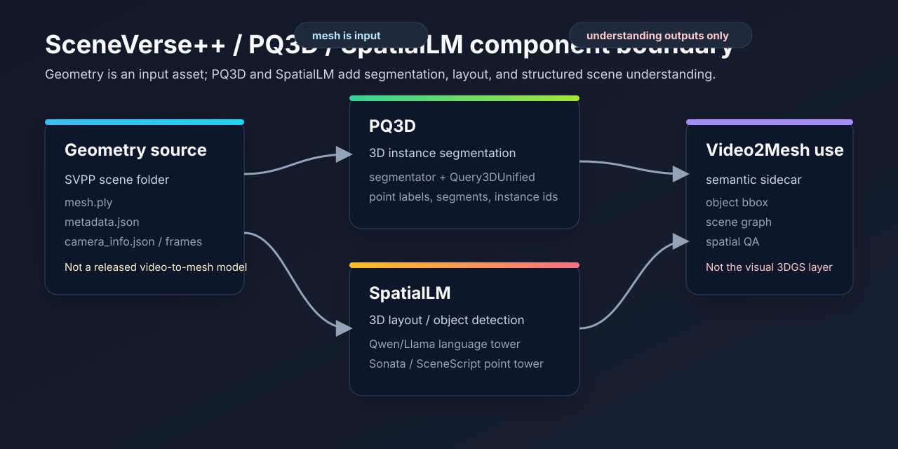

# SceneVerse++ / PQ3D / SpatialLM 组件边界



## 链接

- SceneVerse++ project page: https://sv-pp.github.io/
- SceneVerse++ paper: https://arxiv.org/abs/2506.07491
- SceneVerse++ dataset: https://huggingface.co/datasets/bigai/SceneVersepp
- PQ3D upstream: https://github.com/PQ3D/PQ3D
- SpatialLM upstream: https://github.com/manycore-research/SpatialLM
- SpatialLM base model: https://huggingface.co/manycore-research/SpatialLM1.1-Qwen-0.5B
- Local SceneVerse++ clone: `/Users/zhangyuxiang/Desktop/worksplace/Video2Mesh/SceneVersepp`
- Local bedroom_4 result archive: `docs/video2mesh/experiments/sceneversepp-pq3d-bedroom4.md`

## 核心结论

SceneVerse++ 的公开仓库不是一个单体式“视频到三维重建模型”。本地代码证据显示，它把公开内容分成三块：`data_processing/` 负责下载视频、抽帧和相机位姿可视化；`PQ3D/` 负责 3D instance segmentation training；`SpatialLM/` 负责 3D object detection / layout training。

对 Video2Mesh 来说，PQ3D 与 SpatialLM 应该被放在 **语义与 Scene Graph 层**，而不是几何重建主链路。它们可以消费已有的 `mesh.ply`、点云、实例点索引和 `metadata.json`，再产出 object id、instance label、layout、bbox、scene graph 或 spatial QA 所需的结构化证据。它们不能替代 Video2Mesh 当前的 `video -> COLMAP dense -> GraphDECO 3DGS -> mesh / semantic sidecar -> simulator bundle` 主流程。

## 组件分工

| 组件 | 官方/本地定位 | 输入 | 输出 | 应接入 Video2Mesh 的位置 | 不能误解成 |
|---|---|---|---|---|---|
| `data_processing/` | 轻量数据处理脚本 | SceneVerse++ 场景目录、视频链接、相机文件 | downloaded videos、images、crop_images、camera pose visualization | 数据检查和样本浏览 | 从视频重建 mesh / 3DGS 的完整 pipeline |
| PQ3D | 3D instance segmentation training | `mesh.ply`、`metadata.json`、segmentator segments、instance point ids | point cloud tensors、instance labels、segment ids、训练 checkpoint | object-level semantic sidecar、instance mask、mesh/point label 审阅 | mesh 生成器或 3DGS 生成器 |
| SpatialLM | 3D object detection / structured indoor modeling | `mesh.ply` 顶点/颜色、`metadata.json`、layout text、pcd | layout `.txt`、pcd `.ply`、instruction dataset、Qwen/Llama-based model outputs | layout、object bbox、scene graph、spatial QA 数据层 | 几何重建、表面重建或视觉渲染模型 |

## PQ3D

PQ3D 在 SceneVerse++ 里的职责是把已有场景几何转成 3D instance segmentation 可训练数据，并训练实例分割模型。`SceneVersepp/PQ3D/README.md` 明确写的是 “data generation and 3D instance-segmentation training”，训练分两段：先在 SVPP 上 pretrain，再用 ScanNet fine-tune。

本地关键代码路径是：

```text
SceneVersepp/PQ3D/data_process/generate_dataset.py
SceneVersepp/PQ3D/configs/svpp_gt.yaml
SceneVersepp/PQ3D/configs/svpp_gt_scannet_fps.yaml
```

数据生成脚本先检查 `scene_root / "mesh.ply"` 是否存在，再读取 `metadata.json`。segmentator 只负责对已有 mesh 做片段划分，随后代码读取 mesh 顶点、颜色和 metadata 中的 `point_ids`，生成 `vertex_instance`、`inst_to_label`、`scan_data/*.pth` 和 `segment_id/*.npy`。这说明 PQ3D 消费的是已有场景 mesh / point supervision，不是从视频恢复表面。

模型配置中 `model.name` 是 `Query3DUnified`，主要模块包括：

| 模块 | 配置/代码证据 | 作用 |
|---|---|---|
| `Query3DUnified` | `PQ3D/configs/svpp_gt.yaml` | 统一的 3D query-based instance segmentation model |
| `PCDMask3DSegLevelEncoder` | `model.voxel_encoder.name` | 对点云/voxel 层级特征编码 |
| `ObjectEncoder` | `model.mv_encoder.name` | 对 object / multiview 相关特征编码 |
| segmentator | `PQ3D/data_process/segmentator` | 对已有 mesh 做 over-segmentation / segment id 预处理 |
| `InstSegEval` | `eval.name` | 评估实例分割输出 |

### PQ3D 输入输出合同

```text
SVPP scene folder
  -> mesh.ply
  -> metadata.json with point_ids and pred_class_name
  -> segmentator segments
  -> vertices / colors / vertex_instance tensors
  -> instance_id_to_label
  -> segment_id npy
  -> PQ3D instance segmentation training / evaluation
```

在 Video2Mesh 里，它最适合做的是实例级语义证据：把 mesh/point cloud 中的点或片段归到 object id，再作为 semantic mesh、object split、bbox 审阅、scene graph 的输入。它不应该直接被宣传为“SVPP 三维重建模型”。

## SpatialLM

SpatialLM 在 SceneVerse++ 里的职责是把场景点云和 layout 变成可由语言模型学习的 structured indoor modeling 数据。`SceneVersepp/SpatialLM/README.md` 的工作流是安装 SpatialLM 环境、生成 SVPP/ScanNet 训练数据、可视化 point cloud + layout、再 pretrain / fine-tune / inference / evaluation。

本地关键代码路径是：

```text
SceneVersepp/SpatialLM/data_generation/svpp/generate_layout.py
SceneVersepp/SpatialLM/data_generation/svpp/generate_dataset.py
SceneVersepp/SpatialLM/configs/pretrain.yaml
SceneVersepp/SpatialLM/spatiallm/model/spatiallm_qwen.py
SceneVersepp/SpatialLM/spatiallm/model/spatiallm_llama.py
```

`generate_layout.py` 同样从 `data_root / seq_name / "mesh.ply"` 和 `metadata.json` 开始。它读取 mesh 顶点和颜色，把点云平移到统一坐标，按 `voxel_size` 下采样，然后写出 `pcd/<scene>.ply` 和 `layout/<scene>.txt`。这条路径生产的是 SpatialLM 的点云和布局训练输入，不是高质量可视化 3DGS，也不是 mesh reconstruction。

模型侧，`configs/pretrain.yaml` 使用 `template: spatiallm_qwen`，默认 `model_name_or_path: ./models/basemodel`，README 指向 `manycore-research/SpatialLM1.1-Qwen-0.5B`。代码里 `SpatialLMQwenForCausalLM` 继承 `Qwen2ForCausalLM`，并挂接 `SCENESCRIPT` 或 `SONATA` point backbone；另有 `SpatialLMLlamaForCausalLM` 继承 `LlamaForCausalLM`。这类结构适合把点云上下文接入语言模型，输出布局、对象描述或结构化代码，不负责生成三角网格表面。

### SpatialLM 输入输出合同

```text
SVPP scene folder
  -> mesh.ply vertices / colors
  -> metadata.json object boxes and labels
  -> voxel-downsampled point cloud pcd
  -> layout text
  -> instruction dataset
  -> SpatialLM Qwen/Llama training or inference
  -> object layout / detection / structured scene description
```

对 Video2Mesh 来说，SpatialLM 的价值在于补充 layout、bbox、空间关系和 QA 语料。它可以帮助回答“床、柜、墙、窗帘和可通行区域在哪里”，但视觉层仍应由 GraphDECO / Spark / SuperSplat 等 3DGS 路线负责，碰撞和物理仍应落到 mesh / collider / sidecar。

## 与 bedroom_4 实验的对应关系

`bedroom_4` paper-like 运行已经传回并归档了原始 PLY。这个结果正好说明两个组件的边界：

| 产物 | 观察 | 组件边界 |
|---|---|---|
| `instance_seg_mesh.ply` | 570,255 vertices / 190,085 faces，含 `object_id`、`object_probability`、`source_face` | 适合做语义 mesh 和 object-level 审阅 |
| `mesh_pq3d_float_rgb_uintface.ply` | 94,249 vertices / 190,085 faces，PQ3D segmentator 兼容格式 | 是 PQ3D 消费的 mesh 格式，不是 3DGS |
| `spatiallm_data/pcd/bedroom_4.ply` | 91,412 vertices，只有 `x/y/z` | 是普通 SpatialLM 点云，不能当高质量 visual layer |

这次实验里 mesh 建模效果很好，语义 mesh 可读性强；点云则仍是普通点云，有待提高。正确结论不是“PQ3D/SpatialLM 已经替代 Video2Mesh 重建”，而是“SceneVerse++ 组件能把已有几何整理成更可用的语义、实例和布局监督”。

## 在 Video2Mesh 中的接入建议

| 接入层 | 建议 | 原因 |
|---|---|---|
| `semantic sidecar` | 优先接 | PQ3D 的 instance ids 和 SpatialLM 的 layout/bbox 可直接服务 object metadata |
| `mesh face semantics` | 可接 | PQ3D/metadata 的 point ids 可作为 face transfer 或 mesh split 的监督来源 |
| `scene graph / spatial QA` | 可接 | SpatialLM 的结构化输出适合和 VLM relation QA 合并 |
| `visual 3DGS layer` | 不接为替代 | PQ3D/SpatialLM 不输出 opacity/scale/rotation/SH 等 Gaussian 属性 |
| `collider / physics proxy` | 间接接 | 语义能帮助分 object 和 material，但 collider 仍要 mesh 清理、简化和物理代理生成 |
| `video-to-mesh reconstruction` | 不接为替代 | 公开 SceneVerse++ repo 未释放完整从 web video 到 mesh 的重建模型 |

## 环境和运行成本

SceneVerse++ 公开仓库也把环境拆开了，不能当一个轻量 Python 包处理：

| 层 | 环境特征 | 工程判断 |
|---|---|---|
| `data_processing/` | Python 3.10，轻量依赖，下载/抽帧/位姿可视化 | 本地可做样本检查 |
| PQ3D | 需要 MinkowskiEngine、flash-attn、torch-scatter、spconv 等重依赖 | 更适合在 CUDA 服务器上跑数据生成和训练 |
| SpatialLM | Python 3.11、Poetry、Qwen/Llama base model、Sonata 或 SceneScript point tower | 需要独立模型缓存和训练/推理环境 |

PQ3D 配置中默认 `num_gpu: 4`、per-GPU `batchsize: 8` 的训练形态说明它不是轻量本地训练任务。SpatialLM 的 pretrain 配置里 `cutoff_len: 8192`、`per_device_train_batch_size: 4`、训练 epoch 数很高，也应该被当作重模型训练栈，而不是普通数据转换脚本。

## 风险

| 风险 | 说明 | 缓解 |
|---|---|---|
| 把理解组件写成重建模型 | 会误导 Video2Mesh 主链路设计 | 文档和报告中固定使用“instance segmentation / layout / scene understanding”口径 |
| 将普通点云当 3DGS | SpatialLM pcd 缺少 Gaussian 字段 | 3DGS 仍从 GraphDECO / Spark / SuperSplat 路线输出 |
| segmentator 与系统库不匹配 | 官方二进制可能要求更高 GLIBC/GLIBCXX | 在目标服务器部署匹配运行时或重新编译 segmentator |
| 单场景结果泛化过度 | `bedroom_4` 只能证明接入可行和产物形态 | 继续用更多 SVPP 场景做 sanity check 和质量统计 |
| 坐标系与实例索引漂移 | mesh 中心化、downsample、face transfer 可能改变索引 | 每个导出记录 source mesh hash、vertex/face count、transform 和映射策略 |

## 当前结论

短期最合理的路线是保留 Video2Mesh 的几何主链路：COLMAP / dense init / GraphDECO 3DGS / mesh reconstruction / semantic sidecar。SceneVerse++ 的 PQ3D 和 SpatialLM 作为 **结构化 3D scene understanding 增强层** 接入，用来提升 object id、layout、bbox、scene graph 和 spatial QA。

这条边界清楚以后，后续迭代就不会把“普通点云”误当“高质量 3DGS”，也不会把“实例分割模型”误写成“mesh 重建模型”。
