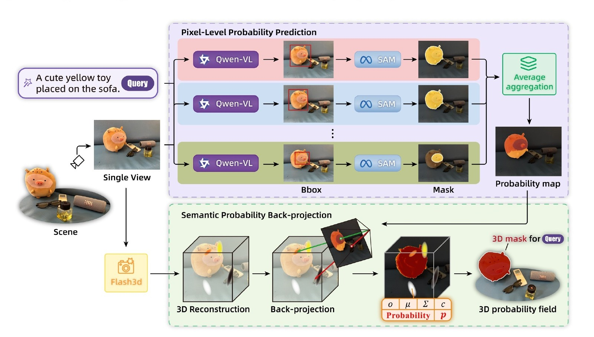
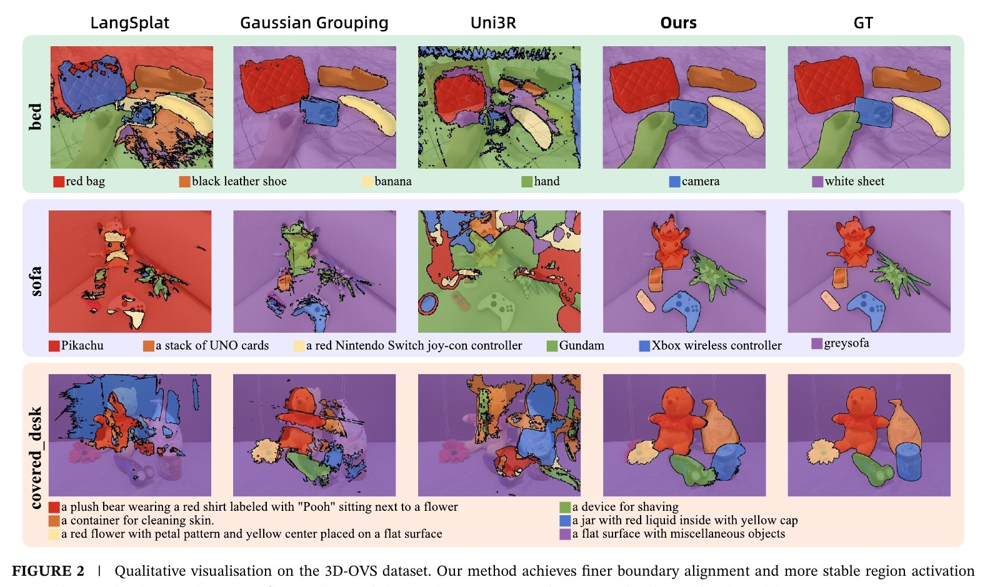
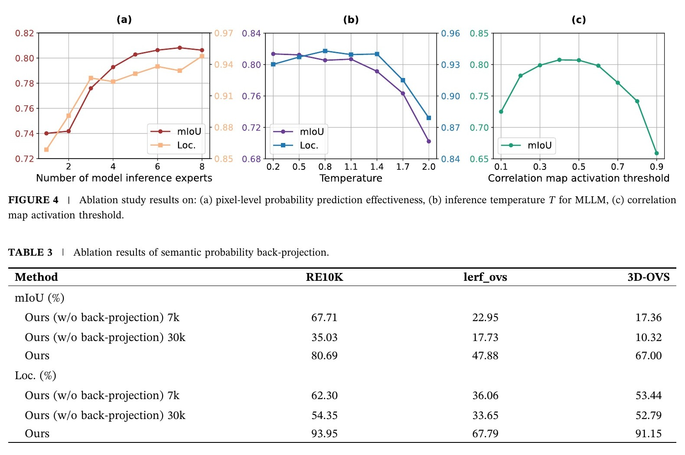

# SVLGaussian：单视图语言高斯查询与 Video2Mesh 工程适配



检查日期：2026-07-26

## 文档沿革

本页不是重复新建：它以 2026-06-20 的历史文档 `SVLGaussian_frame_matching_notes.md` 最后版本为基础。该旧文件在 2026-07-01 文档整合时删除，选帧内容被部分迁入 `docs/video2mesh/legacy/02-pipeline-and-commands.md`。本次将原有的 5/10-frame offset、30-frame random interval、±3-frame visibility window 和 crop diversity 说明保留在当前 canonical 调研目录，同时补齐正式期刊论文的方法、实验和风险。

## 当前结论

SVLGaussian 的关键贡献不是“用一张图恢复测量级完整三维”，而是把单图前馈模型生成的 Gaussian 场作为几何载体，再把自然语言条件下的 2D 语义概率写入每个 Gaussian。它避开 LangSplat 式逐场景语义优化，用一次 ray-to-Gaussian 概率回投支持从新视角渲染语义响应。

对 Video2Mesh 最有价值的是两点：

1. 已经落地的 `SVLGaussian-style` 选帧协议，为对象裁图和后续 mesh/completion jobs 提供可复现的 anchor/offset/random slots。
2. 已经实现的 `backproject-gaussian-probabilities`，可把高质量 2D masks/probabilities 直接写回现有 clean 3DGS。

但当前 Video2Mesh 没有接入论文的 Flash3D 单图几何，也没有运行 Qwen-VL 六轮随机推理，因此只能称为协议复用和概率回投工程适配，不能称为完整 SVLGaussian 复现。

本页状态为 **Paper audited / Frame-selection protocol reused / Back-projection partially reused / Exact pipeline not tested**。

## 链接

- DOI: https://doi.org/10.1049/cit2.70148
- Wiley / CAAI Transactions on Intelligence Technology: https://ietresearch.onlinelibrary.wiley.com/doi/10.1049/cit2.70148
- 本地源 PDF：`钱塘观潮申报书/djj-paper/CAAI Trans on Intel Tech - 2026 - Wang - SVLGaussian  Single View Language Gaussian Splatting.pdf`
- 历史选帧说明最后提交：`27f014c72cd6ed9adf46672e12dfaebdee035d6b`

论文提供的 PDF 中没有给出官方代码仓库或项目页，本页不虚构公开实现链接。

## 基本信息

| 项 | 内容 |
|---|---|
| 标题 | SVLGaussian: Single View Language Gaussian Splatting |
| 期刊 | CAAI Transactions on Intelligence Technology, 2026, 11:875-899 |
| DOI | 10.1049/cit2.70148 |
| 作者 | Jiachen Wang、Mingyang Ding、Min Tan、Luocheng Zhang、Jingrui Fan、Wenwen Pan、Zhou Yu、Jiajun Ding |
| 机构 | 杭州电子科技大学、上虞科学与工程研究院、浙江省空间信息感知与传输重点实验室 |
| 收稿 / 修回 / 接收 | 2025-10-19 / 2026-03-19 / 2026-04-14 |
| 核心任务 | 单张 RGB + 自然语言查询 -> 3D Gaussian semantic probability field |
| 主要模型 | Flash3D `re10k_v2`、Qwen-VL/Qwen2.5-VL、SAM ViT-H |

## Pipeline

```text
single RGB + camera intrinsics/extrinsics + language query
  -> resize to 256 x 384 and add 32-pixel border
  -> frozen Flash3D re10k_v2 predicts Gaussian geometry
  -> Qwen-VL predicts target bounding box six times at T = 0.8
  -> SAM converts each box to a binary mask
  -> average masks into pixel-level semantic probability map
  -> construct one camera ray for each foreground pixel
  -> associate nearby Gaussian centers with the ray
  -> Top-N distance-weighted probability accumulation
  -> write one semantic probability p_i per Gaussian
  -> alpha composite semantic probabilities from novel views
  -> threshold rendered response at lambda = 0.5
```

| 组件 | 输入 | 输出 | 作用 | 不负责什么 |
|---|---|---|---|---|
| Flash3D | 单张 RGB、相机 | feed-forward Gaussian field | 提供单视图几何与新视角渲染载体 | 测量级深度、完整遮挡后几何或语义 |
| Qwen-VL multi-round sampling | image + query + temperature | 多个候选 boxes | 通过随机采样减轻单次 MLLM 幻觉 | 像素级边界 |
| SAM | image + bbox | binary mask | 把每轮 box 变成精细 2D mask | 3D 一致性 |
| Pixel probability aggregation | 多轮 masks | `M_p(u)` | 将六次离散 mask 平均成像素概率 | 新视角几何 |
| Ray-to-Gaussian association | camera ray + Gaussian centers | candidate Gaussians | 找到射线圆柱邻域内的 Gaussian | 遮挡后真实表面恢复 |
| Weighted back-projection | pixel probability + ray distance | per-Gaussian `p_i` | 将 2D 概率按距离权重写入 3D | 通用语言 embedding |
| Probability splatting | `p_i`、opacity、view | semantic response map | 从新视角渲染查询相关度 | object identity sidecar 或 collider |

## 几何与语义生成边界

论文初始化后冻结全部 Gaussian 几何参数，不再进行场景级几何优化。语义学习也不是一个可复用的 CLIP language feature field，而是针对当前 query 生成一个标量概率 `p_i`。换一个查询，需要重新运行 MLLM/SAM 并生成另一份概率响应。

因此，SVLGaussian 输出更适合解释为：

```text
single-view geometry prior
  + query-conditioned scalar probability per Gaussian
```

而不是：

```text
metric-complete scene mesh
  or persistent multi-class scene graph
  or simulator-ready collider
```

## 论文结果

### 语义分割与定位

| Dataset | Named mIoU / Loc. | Descriptive mIoU / Loc. |
|---|---:|---:|
| RE10K | **80.69 / 93.95** | **69.16 / 81.33** |
| lerf_ovs | **47.88 / 67.79** | **43.97 / 59.13** |
| 3D-OVS | **67.00 / 91.15** | **65.50 / 88.85** |



这些数字是论文 Table 1 的作者报告结果。由于没有公开的同任务单图模型，LangSplat、Gaussian Grouping 和 Uni3R 都被修改或压缩到单图输入，基线与原始设计条件并不完全相同。

### 消融



| 设置 | 论文判断 |
|---|---|
| MLLM rounds | `n = 6` 最稳；继续增加没有稳定收益 |
| Temperature | `T = 0.8` 在探索和稳定性之间最好 |
| Correlation threshold | `lambda = 0.5`；过低会过分割，过高会漏掉有效 Gaussian |
| 去掉 back-projection | RE10K 7k 优化只有 67.71 mIoU / 62.30 Loc.，完整方法为 80.69 / 93.95 |
| 延长到 30k | 单图语义优化进一步过拟合，性能下降 |

### 运行成本

主文端到端时间为 RE10K `0.190 min`、lerf_ovs `0.208 min`、3D-OVS `0.257 min`。附录按模块报告：

| Dataset | 3D reconstruction | Pixel probability local | Pixel probability API | Back-projection |
|---|---:|---:|---:|---:|
| RE10K | 0.80 s | 2.85 s | 2.33 s | < 0.01 s |
| 3D-OVS | 3.81 s | 4.30 s | 3.98 s | < 0.01 s |
| lerf_ovs | 2.82 s | 2.97 s | 2.43 s | < 0.01 s |

本地 Qwen-VL 设置额外使用 3 张 RTX 3090 并行六轮推理，Flash3D 和 SAM 使用 1 张 RTX 3090；API 模式可将本地 GPU 需求降为 1 张。主表端到端时间与附录模块求和口径并不完全一致，引用时应保留原表语境。

## 论文内部需要谨慎引用的地方

- 主文写 RE10K 选择了 281 camera sets、573 objects、1719 masks，附录却写 246 test camera sets、544 objects、1632 masks，数据规模存在内部不一致。
- 附录的 RE10K 排名表正文写 246 cases，但各方法名次计数相加出现 247；不宜把该统计作为精确无歧义证据。
- large perspective offset 下 RE10K mIoU 从 80.76 降至 55.74，说明单图前馈几何与语义并不对大视角变化免疫。
- 小物体是论文明确承认的主要失败点，电源插座等 tiny targets 容易触发 MLLM box 幻觉。
- 论文报告的是 semantic mIoU 和 localization accuracy，没有报告深度、表面、尺度、mesh 或物理参数精度。

## 历史工程适配：选帧协议

历史 `SVLGaussian_frame_matching_notes.md` 的目标不是复现单图语义查询，而是从论文的数据评测协议中复用可重复的视角间隔：

```text
best visible anchor
  + frame offset 5
  + frame offset 10
  + random frame in a 30-frame interval
  + lerf_ovs-style +/- 3 frame visibility window
  + masked crop diversity fallback
```

当前命令仍可用：

```bash
python -m video2mesh.cli select-frames \
  --project-root exports/<run> \
  --selection-method svlgaussian \
  --top-k 4
```

### 输入与评分

```text
masks/2d/<object_id>/<frame>.png
masks/3d/<object_id>/point_indices.json
scene/frames or scene/mast3r_keyframes
camera_info.json
```

每个候选帧评估 mask area、3D hit points、sharpness 和 masked crop diversity。anchor 优先覆盖 5/10 offsets，再按物体可见性排序；缺失 protocol slot 时才使用 `32 x 32 grayscale crop -> normalized dot-product similarity` 补齐。

### 输出

```text
objects/<object_id>/selected_frames/
simulator_assets/selected_frames.json
simulator_assets/frame_selection_matching/frame_selection_matching_report.json
simulator_assets/frame_selection_quality_report.json
```

报告会记录 DOI `10.1049/cit2.70148`、selection reason、offset coverage、`protocol_slots.expected_top_k` 和 per-object offset match details，并明确标注它是 protocol adaptation，不是完整论文复现。

## 当前概率回投实现

Video2Mesh 已有：

```bash
python -m video2mesh.cli backproject-gaussian-probabilities \
  --project-root exports/<run>
```

默认参数包括 `top_n=8`、`ray_radius_pixels=3.0`、`weight_sigma_pixels=1.5`、`pixel_stride=2` 和 `output_min_probability=0.5`。主要输出为：

```text
simulator_assets/semantic_splats.ply
simulator_assets/semantic_splats_manifest.json
simulator_assets/semantic_gaussian_probabilities.ply
```

该实现复用了 ray-to-Gaussian probability back-projection 思路，但输入通常来自已有 GroundingDINO/SAM2、SAM3 或其他 masks，并没有执行论文的单图 Qwen-VL 六轮概率生成，也不依赖 Flash3D 几何。

## 官方 Pipeline 与本地状态

| SVLGaussian 阶段 | Video2Mesh 当前对应 | 状态 |
|---|---|---|
| 单图 Flash3D `re10k_v2` 几何 | 当前主线为 COLMAP + GraphDECO / PGSR 多视图 3DGS | Not tested |
| Qwen-VL 六轮 bbox | 尚未接入该 query-time sampling contract | Not tested |
| SAM ViT-H masks | 已有 SAM2/SAM3 masks，但来源和调用协议不同 | Reused |
| 像素概率平均 | 当前可消费 mask probability；不等价于六轮 Monte Carlo average | Proxy |
| Ray-to-Gaussian back-projection | `backproject-gaussian-probabilities` | Reused |
| Novel-view probability rendering | semantic PLY / preview 可消费概率字段 | Partial |
| 5/10/30/±3 视角协议 | `select-frames --selection-method svlgaussian` | Reused |
| RE10K / lerf_ovs / 3D-OVS benchmark | 未下载、未运行 | Not tested |

## 与当前 SimFoundry 语义资产的边界

当前 `simfoundry_bedroom4_static_object_scene_p1_20260708_161534` 的 971,305-vertex semantic 3DGS 是从 semantic mesh debug PLY 最近邻迁移到 clean GraphDECO 30k PLY 的恢复 baseline。它不是 2D mask probability back-projection，也不是 SVLGaussian。

Holi-Spatial fresh run 已经把 SAM3 2D masks 直接投影到 PGSR Gaussians，方法边界更接近 SVLGaussian-style 2D-to-Gaussian semantics，但仍使用多视图 PGSR、真实多帧 masks 和 Video2Mesh 自有可见性过滤，不是单图 Flash3D pipeline。

## 接入判断

- P0：保留当前 `svlgaussian` 选帧协议和 quality reports，用于 object crops / mesh completion 输入准备。
- P1：以 SAM3/Holi-Spatial 概率 masks + clean GraphDECO/PGSR Gaussians 运行 back-projection，先提升当前 semantic 3DGS，而不是强制换成 Flash3D 单图几何。
- P1：新增 query-conditioned probability sidecar，避免每个文本查询都复制整份大型 visual PLY。
- P2：若要验证完整论文，单独部署 Flash3D `re10k_v2`、Qwen-VL 六轮采样和 RE10K protocol，不能把现有多视图结果冒充单图结果。
- 风险：单图几何在遮挡、室外大深度跨度和大视角偏移下会退化；2D 幻觉与射线半径又会把错误写入多个 Gaussians。
- 不替代：visual 3DGS、mesh/collider、scene scale、physics sidecar 和 simulator asset bundle。
