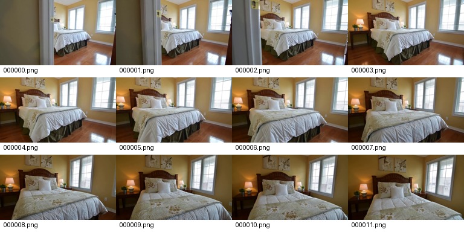
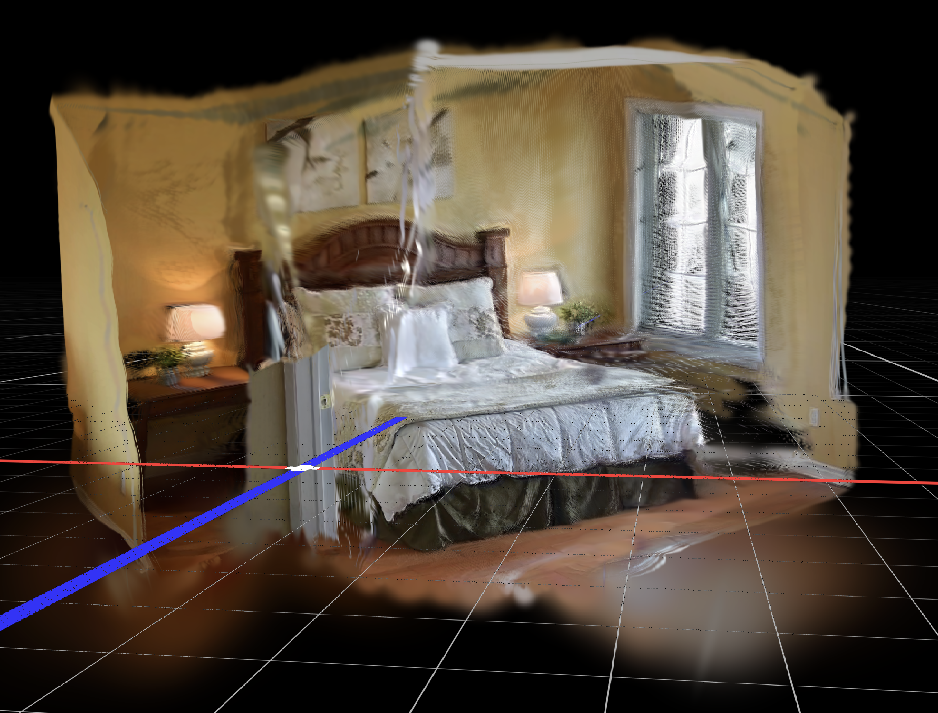

# AnySplat



## 链接

- Project page: https://city-super.github.io/anysplat/
- Code: https://github.com/OpenRobotLab/AnySplat
- Paper: https://arxiv.org/pdf/2505.23716
- Hugging Face model: https://huggingface.co/lhjiang/anysplat
- Hugging Face demo: https://huggingface.co/spaces/alexnasa/AnySplat
- 论文/版本: ACM Transactions on Graphics, 2025
- 作者与单位: Lihan Jiang, Yucheng Mao, Linning Xu, Tao Lu, Kerui Ren, Yichen Jin, Xudong Xu, Mulin Yu, Jiangmiao Pang, Feng Zhao, Dahua Lin, Bo Dai 等

## 一句话结论

AnySplat 是当前最贴近“从随手视频帧直接出 3DGS”的前馈路线之一。它可以从 unconstrained views 同时预测 Gaussian、depth 和 camera pose，适合作为 Video2Mesh 的 **快速 visual baseline / pose-depth-Gaussian prior**；但 bedroom_4 实测显示，它的原生 PLY 和预测相机仍需要严格 QA，后接 GraphDECO 7k refinement 也不一定比原生前馈输出更干净。

## 摘要要点

AnySplat 的问题设定比 pixelSplat / MVSplat 更接近真实视频输入：它不要求输入已经严格 calibrated，而是从一组 unconstrained images 出发，通过 transformer-based geometry encoder 和多个 decoder heads 预测 Gaussian 参数、depth map 和 camera poses。官方 README 描述的三个 decoder heads 分别对应 Gaussian 参数、深度和相机位姿；训练中还引入 VGGT 这样的 pretrained geometry prior 约束几何。

官方工程栈是 Python 3.10+、PyTorch 2.2.0、CUDA 12.1。快速使用路径是 `AnySplat.from_pretrained("lhjiang/anysplat")`，把若干图片处理成 `[1, K, 3, 448, 448]` 后调用 `model.inference((images + 1) * 0.5)`，返回 `gaussians` 和 `pred_context_pose`。这意味着 AnySplat 的输出不只是 PLY，还包括预测相机，可以被拿去构造短程 GraphDECO refinement 的 COLMAP-like source。

对 Video2Mesh 来说，AnySplat 的价值在于：当 COLMAP 或 GraphDECO 训练之前需要快速判断一个视频片段有没有足够视角覆盖时，它能很快给出一个 Gaussian visual guess 和相机/深度线索。但它仍属于 visual-3dgs，不属于 mesh-reconstruction；它输出的是 Gaussian visual proxy，不是 triangle mesh、collider 或物理资产。

## 方法与工程要求

| 项 | 内容 |
|---|---|
| 方法类型 | Feed-forward 3D Gaussian Splatting from unconstrained views |
| 输入 | 图片集合或视频抽帧；官方 demo 支持上传 images/video |
| 模型输出 | 3D Gaussians、predicted context poses、predicted intrinsics、depth / render video 路线 |
| 官方环境 | Python 3.10+、PyTorch 2.2.0、CUDA 12.1 |
| 权重来源 | Hugging Face: `lhjiang/anysplat` |
| 几何先验 | README 提到使用 pretrained VGGT 生成 pseudo-geometry priors |
| 对 Video2Mesh 的合适角色 | 快速 visual baseline、无位姿/弱位姿 fallback、GraphDECO 初始化候选、pose/depth prior |
| 不合适角色 | 直接替代 GraphDECO P0 visual layer、直接建 mesh/collider、直接生成 simulator physics body |

## Pipeline

| 阶段 | 作用 | 输出 |
|---|---|---|
| Frame sampling | 从视频抽取稀疏输入帧 | image set |
| Image processing | resize / normalize 到模型输入 | `[1, K, 3, 448, 448]` |
| Geometry encoder | 融合多视角视觉和几何线索 | scene features |
| Gaussian / depth / camera heads | 分别预测 Gaussian 参数、depth、camera pose | `gaussians`, `pred_context_pose` |
| Differentiable voxelization | 将 pixel-wise 3D Gaussians 聚合成 pre-voxel Gaussians | compact Gaussian set |
| PLY / camera export | 导出 Gaussian PLY 和预测相机 | `gaussians.ply`, `predicted_cameras.npz` |
| Optional post optimization | 官方提供 post optimization，或接 GraphDECO 短训 | refined visual 3DGS |

几何生成路径要分清：AnySplat 不是先重建 triangle mesh，再转 3DGS；它直接预测 Gaussian field，并可同时预测相机和深度。PLY 里的 Gaussian center、scale、rotation、opacity 是渲染代理，不是可碰撞表面采样点。即使它比 DepthSplat 更偏 unconstrained-view，也不能跳过全局一致性、scale、floater 和 viewer QA。

## 本项目 bedroom_4 原生 AnySplat 实验

| 项 | 记录 |
|---|---|
| 远端结果 | `/data/zyx/workspace/Video2MeshWorkspace/Video2Mesh/third_party/AnySplat/runs/bedroom_4_anysplat_2fps_refine_try_20260709_165059/` |
| 本地同步小文件 | `tmp_remote_results/bedroom_4_anysplat_2fps_refine_try_20260709_165059/` |
| source video | `/data/zyx/workspace/video2mesh/dataset/bedroom_4_CmEIg9gMI74/bedroom_4_Cm_47s_56s.mp4` |
| sample fps | 2fps |
| 原视频信息 | 59.94fps，541 frames，约 9.03s |
| 输入帧数 | 19 |
| 模型输入 | `[1, 19, 3, 448, 448]` |
| GPU | NVIDIA GeForce RTX 3090，`CUDA_VISIBLE_DEVICES=1` |
| PyTorch | `2.2.0+cu121` |
| 权重 | `/data/zyx/cache/hf_models/lhjiang_anysplat` |
| VGGT | `/data/zyx/cache/hf_models/facebook_VGGT-1B` |
| model load | 70.496s |
| inference | 4.158s |
| peak CUDA memory | 9,851,636,224 bytes，约 9.18GiB |
| 输出状态 | `partial_success_video_failed` |

原生推理阶段是成功的：日志记录 `scene scale: 1.035`，pixel-wise Gaussian 数为 3,813,376，voxelize 后为 2,079,470，voxelize ratio 为 0.545。导出的核心文件如下：

| 输出 | 路径 | 大小 / 数量 |
|---|---|---|
| Gaussian PLY | `gaussians.ply` | 141,404,377 bytes，2,079,470 vertices |
| predicted cameras | `predicted_cameras.npz` | 2,422 bytes |
| input contact sheet | `previews/input_contact_sheet.jpg` | 98,735 bytes |
| run metadata | `run_metadata.json` | 记录输入、设备、模型、输出和错误 |

PLY header 为 GraphDECO/SuperSplat 类 Gaussian PLY 字段：`x/y/z`、`f_dc_0..2`、`opacity`、`scale_0..2`、`rot_0..3`。这说明 AnySplat 原生输出确实是可 viewer 消费的 Gaussian PLY。

但原生渲染视频没有完成。失败原因不是 Gaussian PLY 生成失败，而是保存 RGB/depth video 时远端 `gsplat` CUDA wrapper 没正确加载，日志中出现：

```text
gsplat: No CUDA toolkit found. gsplat will be disabled.
AttributeError: 'NoneType' object has no attribute 'CameraModelType'
```

所以这次 AnySplat 原生实验的真实状态应写成：**PLY 和 predicted cameras 已生成；rendered RGB/depth video 未生成**。不要把它写成完整官方 demo 成功。

### 原生 PLY viewer 观察



原生 PLY 的正面视角能看到 bedroom_4 的主体结构：床、床头、两侧床头柜、窗户和墙面都能形成连续外观。这说明 AnySplat 的 feed-forward Gaussian 不是随机点云，而是学到了可用的房间 visual prior。


问题也很明显：斜侧视角下会出现墙面条带、窗边白色漂浮片、床头附近拉伸和局部空洞。这些伪影解释了为什么它适合做快速 baseline / prior，但还不能直接作为 Video2Mesh 的最终 visual layer，更不能直接进入 mesh/collider。

## 后接 GraphDECO 7k refinement 实验


为了测试 AnySplat 是否适合作为 GraphDECO 初始化，我们用原生 AnySplat 输出构造了一个 COLMAP-like source，再跑 GraphDECO 7k。

| 项 | 记录 |
|---|---|
| 本地结果 | `tmp_remote_results/bedroom_4_graphdeco_refine7k_from_anysplat2fps_20260709_182345/` |
| 远端结果 | `/data/zyx/workspace/video2mesh/third_party/AnySplat/runs/bedroom_4_graphdeco_refine7k_from_anysplat2fps_20260709_182345/` |
| source run | `/data/zyx/workspace/Video2MeshWorkspace/Video2Mesh/third_party/AnySplat/runs/bedroom_4_anysplat_2fps_refine_try_20260709_165059` |
| image count | 19 |
| source image size | 1280 x 720 |
| AnySplat processed size | 448 x 448 |
| source Gaussian count | 2,079,470 |
| exported point count | 500,000 |
| point sampling | opacity-weighted without replacement |
| camera assumption | `predicted_cameras` extrinsic treated as camera-to-world, inverted for COLMAP world-to-camera |
| intrinsic assumption | normalized intrinsics converted to source image pixels |

GraphDECO 训练记录：

| 阶段 | 结果 |
|---|---|
| initialization points | 500,000 |
| train cameras | 19 |
| filtered cameras | 14 |
| 1k train metric | L1 0.09156，PSNR 17.299 |
| 7k train metric | L1 0.06033，PSNR 20.633 |
| wall time | 2:54.16 |
| exit status | 0 |
| raw 7k PLY | 466,604 Gaussians，约 110MB |
| conservative cleanup | removed 0 / 466,604 |
| filtered cleanup | removed 28,038 / 466,604，kept 438,566，约 104MB |

这个实验说明：AnySplat 的 predicted cameras 和 Gaussian field 可以被转成 GraphDECO 初始化，并且 GraphDECO 7k 能正常训练到一个可保存的 Gaussian PLY。它也说明短程 refinement 不一定等于更好画面：之前 viewer 对比里，用户反馈 3DGS 7k 的结果不如未训练的前馈结果干净。因此这里更适合把 7k 当成“可行性和指标记录”，而不是直接宣布质量提升。

## 和 DepthSplat 的对比

| 项 | AnySplat | DepthSplat |
|---|---|---|
| 输入假设 | unconstrained views，模型预测 pose | posed multi-view，依赖相机格式 |
| 本项目输入 | 2fps 视频抽帧 19 张 | Video2Mesh native80 中 6 个 context views |
| 原生输出 | 2,079,470 Gaussian PLY + predicted cameras | 622,080 Gaussian PLY + depth |
| 本项目主要问题 | video render 因 gsplat CUDA wrapper 失败；7k refinement 不一定更干净 | PLY 表现为 6 组 context-view Gaussian 拼接，全局融合差 |
| 更适合角色 | pose/depth/Gaussian prior，GraphDECO 初始化候选 | depth prior，posed feed-forward 3DGS baseline |
| 不适合角色 | 直接 collider / mesh / final simulator asset | 直接 collider / mesh / final simulator asset |

## 定性效果

正面结果：AnySplat 在单张 RTX 3090 上能处理 19 张 448x448 输入，前向推理约 4.16s，输出 2.08M Gaussians 和 19 组预测相机。它比 DepthSplat 更适合“没有可靠原生 COLMAP 相机时先猜一个 3DGS 场景”的工作流。


负面结果：这次原生 run 没有完成 RGB/depth video export，说明环境还不完整；GraphDECO 7k 虽然有 train PSNR 20.633，但 viewer 主观质量不一定优于原生 AnySplat。AnySplat predicted cameras 转 COLMAP 的假设也需要审计，不能把它当真实 COLMAP 世界坐标。


从截图看，AnySplat 比原版 GraphDECO 少了很多远处随机漂浮物，主体也更贴近表面；但它会产生带状点云伪影，尤其在墙面、床上方和窗边薄结构附近。这类伪影更像前馈深度/相机/局部几何一致性问题，和 per-scene GraphDECO 训练里的随机 floaters 不完全一样。因此当前更适合把它当快速 baseline 或 GraphDECO 初始化候选，而不是最终 visual layer。

指标情况：AnySplat 原生实验没有官方 NVS protocol 的 PSNR/SSIM/LPIPS；只有前向耗时、显存、Gaussian 数量、输出文件和失败日志。GraphDECO 7k 的 PSNR 是 train-view metric，不是 held-out NVS 指标，不能和官方榜单或 DepthSplat 官方指标直接比较。

## 接入判断

- P0：不替代 GraphDECO 主 visual layer。
- P1：保留为前馈 3DGS baseline，尤其适合无位姿或 COLMAP 不稳的片段。
- P1：可作为 GraphDECO 初始化候选，但必须记录相机假设、采样点数、训练 PSNR、viewer 截图和 cleanup 报告。
- P2：修复远端 gsplat CUDA toolkit / wrapper，使 AnySplat 原生 RGB/depth video export 真正跑通。
- P2：比较 AnySplat 原生 PLY、AnySplat->GraphDECO 7k、Video2Mesh COLMAP->GraphDECO 30k 三者的固定视角截图和 hold-out render。
- 禁止：把 AnySplat PLY 直接当 mesh、collider、semantic truth 或 simulator physics body。

## 下一步实验建议

1. 修复 `gsplat: No CUDA toolkit found`，确认 AnySplat 原生 RGB/depth video 能导出。
2. 用同一批 19 张输入导出固定 viewer screenshots，和 DepthSplat / GraphDECO 30k 做并排对比。
3. 对 predicted cameras 做 COLMAP sparse / VGGT / Video2Mesh COLMAP 的坐标关系审计，确认 scale 和 camera convention。
4. 如果继续接 GraphDECO，优先试 3k / 7k / 15k 三档短训，并记录 floater cleanup 前后差异，不直接默认“训久更好”。
