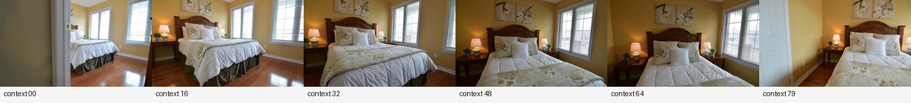
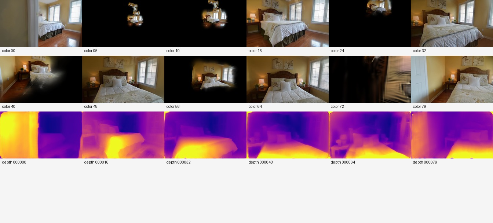
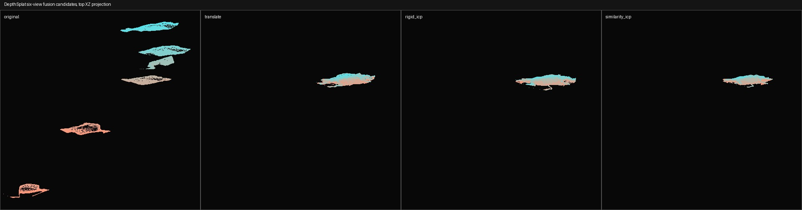
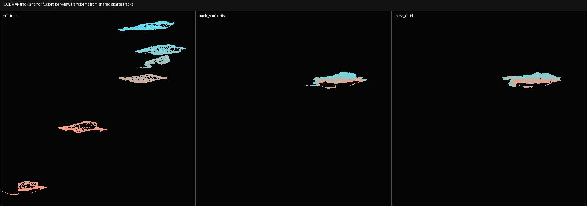
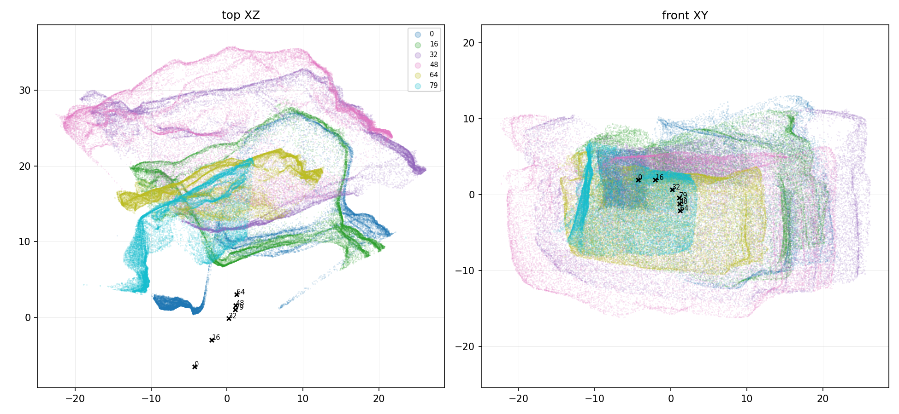
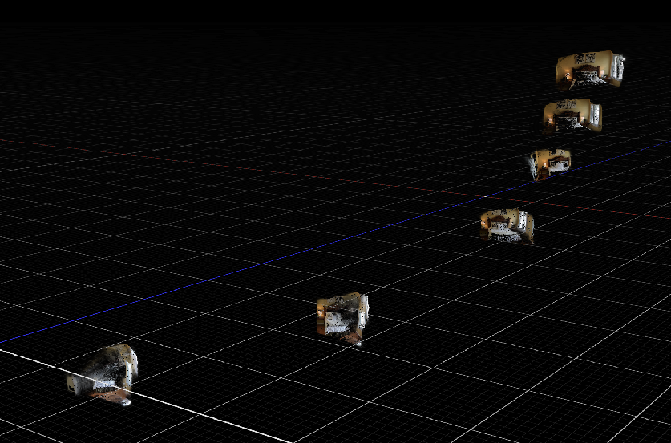

# DepthSplat



## 链接

- Project page: https://haofeixu.github.io/depthsplat/
- Code: https://github.com/cvg/depthsplat
- Paper: https://arxiv.org/abs/2410.13862
- Models: https://huggingface.co/haofeixu/depthsplat
- Venue: CVPR 2025
- 作者与单位: Haofei Xu, Songyou Peng, Fangjinhua Wang, Hermann Blum, Daniel Barath, Andreas Geiger, Marc Pollefeys 等

## 一句话结论

DepthSplat 可以作为 Video2Mesh 的 **前馈 3DGS baseline / 深度先验 / 快速预览路线**，但当前 bedroom_4 实测不适合直接替代 GraphDECO 3DGS，也不适合直接作为 mesh、collider 或 simulator geometry 来源。

本次 native80 实验跑通了 DepthSplat，生成了 40MB、622,080 个 Gaussian vertex 的 PLY；但是该 PLY 在当前导出方式下表现为 6 组 context-view Gaussian 的拼接，每组局部房间有一定结构，但全局重叠位置没有对齐。后续尝试的 ICP、COLMAP tracks、pose scale 和 depth affine scale 都没有把它稳定融合成一套干净的全局房间。

## 摘要要点

DepthSplat 的核心目标是把 Gaussian Splatting 和 depth estimation 连起来：一方面用更好的 depth 产生更好的前馈 Gaussian scene，另一方面用 Gaussian splatting 的无监督训练信号改善 depth 预测。它不是 GraphDECO 那种“每个场景从 COLMAP 初始化后优化 7k/30k steps”的路线，而是训练一个可泛化模型，推理时从少量 context views 直接预测 Gaussian 表示、深度和 novel-view rendering。

官方 README 给出的工程栈是 Python 3.10、PyTorch 2.4.0、CUDA 12.4；相机约定是 normalized intrinsics 和 OpenCV camera-to-world extrinsics。测试配置支持保存 rendered image、input image、depth、depth npy，也支持 `test.save_gaussian=true` 导出 Gaussian PLY，官方说明这个 PLY 可以用 SuperSplat 等 viewer 查看。

对 Video2Mesh 来说，DepthSplat 的价值在于“快”和“可作为 learned depth / Gaussian prior”。它的风险也正来自这里：前馈模型输出的 Gaussians 看起来像场景资产，但并不自动保证多组 context view 在真实 COLMAP 世界坐标里全局一致。当前 bedroom_4 实验说明，直接把 `save_gaussian` 的 PLY 当作一套可融合全局 3DGS 会出问题。

## 方法与工程要求

| 项 | 内容 |
|---|---|
| 方法类型 | Feed-forward 3D Gaussian Splatting + depth estimation |
| 输入 | 多个 context RGB views；官方数据格式包含 normalized intrinsics 和 OpenCV camera-to-world extrinsics |
| 输出 | Novel-view render、predicted depth、depth npy、Gaussian PLY |
| 官方环境 | Python 3.10、PyTorch 2.4.0、CUDA 12.4 |
| 权重来源 | Hugging Face: `haofeixu/depthsplat` |
| 官方速度参考 | README 中提到 12 views、512x960 在单张 A100 上约 0.6s 做 feed-forward reconstruction |
| 对 Video2Mesh 的合适角色 | 快速视觉 baseline、深度候选、GraphDECO refinement 的初始化或辅助 prior |
| 不合适角色 | P0 visual layer 替代、mesh extraction 主路线、collider、physics body、语义真值 |

## Pipeline

| 阶段 | 作用 | 对应输出 |
|---|---|---|
| Context view selection | 从视频或 COLMAP scene 里选若干输入视角 | context image set |
| Camera formatting | 准备 normalized intrinsics 和 camera-to-world extrinsics | dataset manifest / metadata |
| Feed-forward encoder | 从多视角图像预测深度、特征和 Gaussian 参数 | per-view / scene Gaussian attributes |
| Gaussian rendering | 用 predicted Gaussians 渲染 target views | rendered RGB / video |
| Depth export | 保存每个 context 或 target 的深度图 | depth PNG / NPY |
| Gaussian export | 导出 Gaussian PLY | PLY with xyz, opacity, scale, rotation, SH/DC color |

几何生成路径要特别分清：DepthSplat 输出的是 3D Gaussian，不是 triangle mesh。每个 Gaussian 有中心、颜色、opacity、尺度和旋转；viewer 通过 splatting 渲染连续外观。它没有 mesh topology、法线连续性、闭合表面或碰撞体属性，所以不能直接接到 collider、navmesh 或刚体仿真。

## 本项目 bedroom_4 实验记录



### 实验 1: bedroom_4 短片段 smoke run

| 项 | 记录 |
|---|---|
| 本地结果 | `tmp_remote_results/bedroom4_depthsplat_base_dl3dv_6ctx_256x448_retry4_20260709_212034/` |
| 远端结果 | `/data/zyx/workspace/depthsplat/outputs/bedroom4_depthsplat_base_dl3dv_6ctx_256x448_retry4_20260709_212034/` |
| 权重 | `pretrained/depthsplat-gs-base-dl3dv-256x448-randview2-6-02c7b19d.pth` |
| context views | `[0, 3, 7, 11, 15, 18]` |
| target views | `0..18`，共 19 个 target views |
| 输入分辨率 | `256x448`，原图记录为 `720x1280` |
| Gaussian PLY | `gaussians/bedroom_4.ply` |
| PLY 大小 / 顶点数 | 42,301,856 bytes，622,080 vertices |
| 输出数量 | rendered color PNG 19，context input PNG 6，depth PNG 6，depth NPY 6 |
| 备注 | 本地记录显示使用项目 venv 中的 `torch 2.5.0+cu121` 跑通，并应用 rasterizer compatibility patch |

### 实验 2: bedroom_4 Video2Mesh native80 + COLMAP camera

| 项 | 记录 |
|---|---|
| 本地结果 | `tmp_remote_results/bedroom4_depthsplat_video2mesh_native80_base_dl3dv_6ctx_256x448_20260710_155321/` |
| 远端结果 | `/data/zyx/workspace/depthsplat/outputs/bedroom4_depthsplat_video2mesh_native80_base_dl3dv_6ctx_256x448_20260710_155321/` |
| 数据来源 | `/data/zyx/workspace/Video2MeshWorkspace/video2mesh_runs/bedroom_4_scene_only_v2mw_20260709_030359` |
| 相机来源 | `external/graphdeco_3dgs/colmap_source/sparse/0`，即 Video2Mesh/GraphDECO 使用的 COLMAP source camera |
| source images | `external/graphdeco_3dgs/colmap_source/images` |
| context views | `[0, 16, 32, 48, 64, 79]` |
| target view count | 80 |
| 输出 PNG | color PNG 86，depth PNG 6，总 PNG 92 |
| depth NPY | 6 |
| Gaussian PLY | `gaussians/bedroom_4_video2mesh_native80.ply` |
| PLY 大小 / 顶点数 | 42,301,856 bytes，622,080 vertices |
| local PLY | `tmp_remote_results/bedroom4_depthsplat_video2mesh_native80_base_dl3dv_6ctx_256x448_20260710_155321/gaussians/bedroom_4_video2mesh_native80.ply` |

PLY header 里可以看到它是标准 binary little endian Gaussian PLY，字段包含 `x/y/z`、`f_dc_0..2`、`opacity`、`scale_0..2`、`rot_0..3`。顶点数是 `622080`，刚好等于：

```text
6 context views * 103680 Gaussians per view
103680 = 432 * 240
effective_hw = 240 x 432
```

这解释了为什么 viewer 里会看到多组房间：当前导出的 PLY 可以按 6 个 context views 切成 6 份，每份 103,680 个 Gaussian，单个 part PLY 约 6.7MB。它更像“6 组局部高斯的拼接”，而不是 GraphDECO 训练后那种经过全局 photometric optimization 的单一场景 Gaussian field。

## 为什么 COLMAP 位姿没有自动解决融合

这次 native80 不是没有用相机。实验输入明确来自 Video2Mesh 的 COLMAP sparse camera，context frames 也是从同一套 source images 和 sparse/0 相机里抽出来的。

问题在于：COLMAP 位姿只能告诉我们相机之间的几何关系；DepthSplat 前馈模型仍然要预测每个 view 对应的 depth / Gaussian geometry。如果每组预测的局部深度比例、局部形变和高斯中心分布不一致，那么把这些 Gaussian 直接按相机关系拼起来也会出现局部房间重影。换句话说，位姿是必要条件，但不是多组前馈高斯全局一致的充分条件。

## 融合与修复尝试



| 尝试 | 输出 / 证据 | 结果判断 |
|---|---|---|
| 拆分 6 组 Gaussian | `fusion_experiments/bedroom_4_video2mesh_native80_part_view0..5.ply` | 每组 103,680 vertices，说明原 PLY 是按 context view 可切分的 6 组 |
| translate fusion | `fusion_experiments/bedroom_4_video2mesh_native80_fused_translate.ply` | 只能移动局部中心，重叠位置仍对不上 |
| rigid ICP | `fusion_experiments/bedroom_4_video2mesh_native80_fused_rigid_icp.ply` | 局部采样 residual 有下降，但整体房间仍重影 |
| similarity ICP | `fusion_experiments/bedroom_4_video2mesh_native80_fused_similarity_icp.ply` | 允许尺度后 residual 更好看，但仍是局部过拟合，不是全局几何一致 |
| pose-scale fusion | `fusion_pose_scaled/bedroom_4_video2mesh_native80_fused_pose_scale_auto.ply` | 网格搜索最佳 `k=0.016`，但用户检查后仍反馈重叠位置没有对上 |
| COLMAP track anchor fusion | `fusion_colmap_tracks/bedroom_4_video2mesh_native80_fused_colmap_tracks_rigid.ply` | 有 COLMAP tracks，但 robust fit 最终只保留少量局部 inliers，不能代表全局房间一致 |
| COLMAP depth affine scale | `fusion_depth_scale_colmap/bedroom_4_video2mesh_native80_depth_affine_colmap.ply` | 每帧尺度差异大，说明问题不是统一 scale 可修复 |

### COLMAP track anchor 证据



Track anchor 数量看起来不低，但最终 robust similarity/rigid fit 保留的点很少：

| frame | anchors | final kept |
|---|---:|---:|
| 0 | 253 | 7 |
| 16 | 1,017 | 29 |
| 48 | 1,049 | 30 |
| 64 | 817 | 24 |
| 79 | 562 | 16 |

这说明后处理能够对齐某一小片局部结构，但不能证明整组局部 Gaussian 与 reference view 在全局房间坐标里一致。对于 room-scale scene，局部 inlier 对齐很容易给出“看似很低的误差”，但 viewer 里仍会看到墙、床、柜子等结构重复。

### Depth scale / affine 证据



用 COLMAP sparse anchors 去拟合每个 context view 的 predicted depth scale 后，各帧尺度并不稳定：

| frame | scale | after median abs | after p90 abs | ratio median all |
|---|---:|---:|---:|---:|
| 0 | 33.089 | 3.042 | 10.087 | 31.993 |
| 16 | 30.259 | 3.362 | 9.042 | 29.409 |
| 32 | 40.474 | 3.671 | 13.324 | 37.014 |
| 48 | 36.719 | 4.002 | 14.274 | 32.607 |
| 64 | 19.513 | 2.431 | 6.184 | 18.928 |
| 79 | 25.437 | 1.663 | 7.340 | 25.765 |

`ratio_median_all` 从约 18.93 到 37.01，说明不能用一个统一尺度把 6 组 Gaussian 变成可靠全局场景。即使逐帧 scale fit，也只能校正一阶比例，无法修掉局部形变和跨 view consistency 问题。

## 定性效果

正面结果：DepthSplat 在 bedroom_4 上确实跑通了，能输出渲染图、深度图和 Gaussian PLY。单组 context-view Gaussian 单独看有房间结构线索，说明模型在局部几何和外观上不是完全失败。



负面结果：作为一套全局 visual layer，它目前不如 GraphDECO 干净。直接打开导出的 PLY 会看到多组房间重影；尝试把 6 组点云或高斯按相机、ICP、COLMAP tracks 融合后，重叠区域仍然无法稳定对齐。用户对 viewer 的视觉反馈是“效果不好”，这个判断和后处理日志一致。

从截图看，DepthSplat 的单组局部点云伪影少于原版 GraphDECO 和 AnySplat，但它没有形成完整房间，而是 6 个 context view 对应 6 组局部结果。这个结果说明后续不要继续在 PLY 层硬拼，更应把 DepthSplat 的 depth/Gaussian prior 接入 GraphDECO 短程 refinement 或稠密几何正则。

指标情况：本次没有按 DepthSplat 官方 evaluation protocol 计算 PSNR、SSIM、LPIPS，因此报告不填假指标。可确认的实验指标是输出文件、顶点数、context/target view 数量、depth export 数量，以及各类后处理对齐日志。

## 和 Video2Mesh 的关系

Video2Mesh 当前稳定路线是：

```text
video frames
  -> COLMAP camera / sparse / dense geometry
  -> GraphDECO 3DGS visual layer
  -> mesh / collider route
  -> semantic sidecars
  -> simulator asset bundle
```

DepthSplat 更适合放在 visual-3dgs 目录下，而不是 mesh-reconstruction 目录下。它输出 Gaussian visual proxy 和 depth prior，不输出可碰撞 mesh。

## 接入判断

- P0：不接入主链路。当前 bedroom_4 实测不能直接替代 GraphDECO 3DGS。
- P1：保留为前馈 3DGS baseline。用于快速判断视频片段有没有足够视角、纹理、深度线索。
- P1：可作为 depth prior 候选。相比直接用 Gaussian PLY，预测 depth 更可能作为 COLMAP/GraphDECO/TSDF 的辅助信号。
- P2：尝试把 DepthSplat 输出接短程 photometric 3DGS refinement，让 GraphDECO 用 COLMAP cameras 重新优化一套全局 Gaussian field。
- 禁止：直接把 DepthSplat PLY 当 collider、mesh surface 或语义真值。

## 下一步实验建议

1. 用同一组 bedroom_4 frames 对比 AnySplat、DepthSplat、GraphDECO 7k/30k 的 viewer 截图和 PLY header，先确认 visual layer 的清洁度。
2. 不再尝试纯后处理融合 6 组 PLY；改做 `feed-forward Gaussian/depth -> GraphDECO short refinement -> floater cleanup`。
3. 如果继续用 DepthSplat depth，优先把 depth 当作 dense prior 或 scale regularizer，而不是直接把 per-view Gaussian centers 拼成场景。
4. 记录每次实验的 context frame、camera source、PLY 顶点数、PSNR/SSIM/LPIPS 或至少 hold-out render screenshot，避免只凭 viewer 主观印象迭代。
