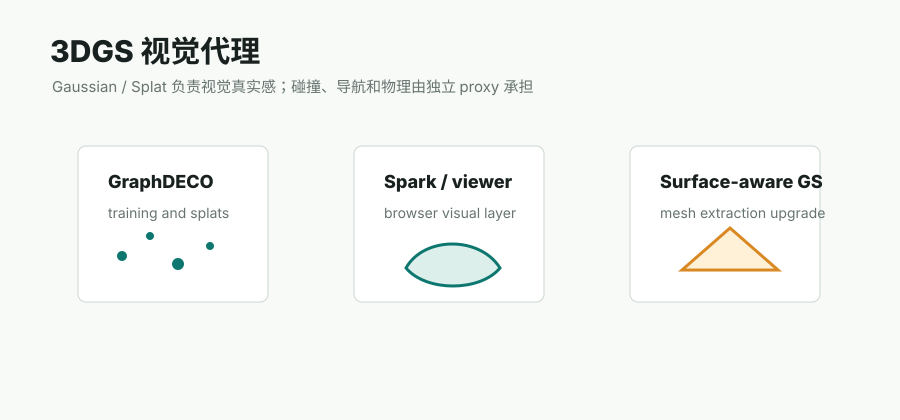

# 前馈 3DGS 专题



## 专题定位

前馈 3DGS 指的是用一个已经训练好的模型，从少量图像、图像对、多视图视频帧，甚至无显式相机位姿的输入中，直接预测 3D Gaussians、相机、深度或 novel-view rendering。它和 GraphDECO 3DGS 的区别很关键：

| 路线 | 输入 | 主要计算 | 输出特点 | 典型用途 |
|---|---|---|---|---|
| GraphDECO / per-scene optimization 3DGS | COLMAP cameras + sparse points + images | 每个场景单独 photometric optimization | 全局一致性更强，质量通常更稳定，但需要训练时间 | Video2Mesh P0 visual layer |
| Feed-forward 3DGS | 少量 posed / unposed / unconstrained views | 预训练模型一次前向推理 | 快速，能给出 Gaussian/depth/pose prior，但场景尺度和一致性需审计 | 快速 baseline、初始化、depth prior、候选视角分析 |

这个专题放在 `visual-3dgs`，不放在 `mesh-reconstruction`。原因是这类方法的主要输出是 Gaussian visual representation，而不是 triangle mesh、watertight surface、collider 或 simulator physics body。

## 方法谱系

| 方法 | 官方定位 | 相机需求 | 几何核心 | 优点 | 风险 | Video2Mesh 角色 |
|---|---|---|---|---|---|---|
| pixelSplat | 3D Gaussian Splats from Image Pairs，CVPR 2024 | 通常需要 posed image pairs / camera convention | epipolar transformer，从图像对预测可泛化 Gaussians | 早期代表路线，代码和评测成熟 | 偏 pair / sparse views，大房间全局一致性不是主目标 | 研究参考，不作为当前主实现 |
| MVSplat | Sparse multi-view 3DGS，ECCV 2024 Oral | posed sparse views | plane sweeping / cost volume 约束深度，再预测 Gaussians | 比 pixelSplat 更强调 MVS geometry，官方相关说明里提到点云更干净、跨数据集泛化更好 | 仍依赖相机和训练域，大场景需要实测 | 可作为 posed sparse-view baseline |
| [DepthSplat](depthsplat.md) | Connecting Gaussian Splatting and Depth，CVPR 2025 | posed multi-view，OpenCV camera-to-world | depth estimation 与 Gaussian splatting 互相增强 | 能导出 depth 和 Gaussian PLY，适合深度先验 | bedroom_4 实测中导出 PLY 是 6 组 context-view Gaussian 拼接，不能直接当全局场景 | P1 baseline / depth prior |
| [AnySplat](anysplat.md) | Feed-forward 3D Gaussian Splatting from Unconstrained Views，TOG 2025 | 目标是 unconstrained views，模型预测 pose | `model.inference` 输出 Gaussians 和 predicted context pose | 很贴近“随手视频帧直接出 3DGS”的需求，bedroom_4 原生推理输出 2.08M Gaussians | 尺度、相机、跨 view consistency 仍需用真实 COLMAP/GraphDECO 审计；本项目 render video 阶段曾因 gsplat CUDA wrapper 失败 | P1 重点对照，适合快速尝试 |
| Splatt3R | Zero-shot Gaussian Splatting from Uncalibrated Image Pairs，arXiv 2024 | uncalibrated image pairs | 借助 MASt3R/Dust3R 系几何 backbone 预测 Gaussian | 不要求先验相机，demo 可导出 PLY | 图像对覆盖有限，大场景和视频全局融合仍要验证 | P2 pair-level fallback / geometry prior |
| NoPoSplat | Sparse unposed images -> canonical-space 3D Gaussians，arXiv 2024 | sparse unposed images | canonical space 预测 Gaussians，同时服务 pose estimation | 明确针对无位姿输入，训练与模型信息完整 | 官方训练配置很重，8 GPUs >=80GB 默认配置，工程成本高 | P2/P3 unposed route 储备 |

## 共同 Pipeline

```text
selected frames
  -> image normalization / resize / crop
  -> optional camera formatting
  -> feed-forward 3D model
  -> predicted cameras / depths / Gaussians
  -> viewer render or Gaussian PLY
  -> optional GraphDECO refinement
  -> cleaned visual 3DGS
```

### 适合作为快速 visual baseline

```text
video segment
  -> sample 6 to 12 views
  -> AnySplat / DepthSplat
  -> PLY + render video
  -> SuperSplat / Spark preview
```

这个路线适合快速看“视频里有没有足够视角覆盖和纹理线索”。如果前馈模型都完全塌掉，说明这个片段可能对后续 COLMAP/3DGS 也有挑战；如果前馈模型给出还不错的局部结构，可以作为进一步训练的候选。

### 适合作为 GraphDECO 初始化或 prior

```text
Video2Mesh frames + COLMAP cameras
  -> feed-forward depth / Gaussians
  -> convert to GraphDECO init or depth regularizer
  -> short 3DGS refinement, e.g. 7k / 15k
  -> floater cleanup
  -> visual layer QA
```

这比“直接拼 PLY”更合理。GraphDECO 的 per-scene optimization 会用所有训练视角的 photometric loss 重新约束一套全局 Gaussian field，可以修正一部分前馈模型的局部尺度和跨 view 不一致。

### 不适合直接做 mesh / collider

```text
feed-forward Gaussian PLY
  -/-> final mesh
  -/-> collider
  -/-> physics body
```

Gaussian center 不是表面采样点，opacity 和 anisotropic scale 也不是 mesh 拓扑。即使 viewer 里看起来像一个房间，也不能直接说明它能用于 Poisson、Delaunay、navmesh 或 Unity/MuJoCo collider。

## 与本项目实验的关系

本项目已经跑过 AnySplat 和 DepthSplat 的 bedroom_4 初步实验。整体经验是：

| 观察 | 解释 |
|---|---|
| 前馈模型能很快输出 PLY / preview | 这类方法适合快速 baseline |
| 单独局部 view 可能看起来还可以 | 模型学到了局部房间结构和外观先验 |
| 多组结果直接融合会重影 | 前馈预测没有经过 per-scene 全局优化，depth/scale/pose consistency 可能不够 |
| 7k GraphDECO refinement 不一定更干净 | 如果初始化或相机/点云不合适，短训可能放大 floaters 或局部噪声 |
| 不能把 PLY 顶点数当作质量指标 | 622,080 vertices 只说明有很多 Gaussians，不说明全局几何干净 |

详细实验见：[AnySplat](anysplat.md) 和 [DepthSplat](depthsplat.md)。

## 评估清单

| 检查项 | 目的 |
|---|---|
| 输入 frames / context views | 确认视角覆盖是否足够，避免抽帧差异导致误判 |
| camera source | 区分原生预测相机、COLMAP 相机、Video2Mesh 相机 |
| PLY header / vertex count | 确认是否是真 Gaussian PLY，是否存在按 view 重复拼接 |
| per-view split test | 检查输出是否是多组 context Gaussian，而不是单一全局场景 |
| viewer screenshot | 直接观察重影、floater、孔洞、局部拉伸 |
| hold-out render | 有 GT 时计算 PSNR、SSIM、LPIPS；没有时至少保存固定相机截图 |
| scale / pose audit | 用 COLMAP tracks 或 sparse anchors 检查全局一致性 |
| short refinement result | 判断前馈结果能否作为 GraphDECO 初始化 |
| cleanup report | 记录 floater pruning 前后数量和视觉变化 |

## 接入建议

- P0 仍使用 GraphDECO 3DGS 作为 Video2Mesh 主 visual layer。
- P1 建立统一的前馈 3DGS benchmark runner，至少覆盖 AnySplat 和 DepthSplat，输出 PLY、render preview、metadata、fixed-view screenshot。
- P1 不再直接将前馈 PLY 送 mesh/collider；先做 visual QA。
- P2 尝试把前馈 depth / Gaussian 变成 GraphDECO 初始化或正则项，而不是在 PLY 层做 rigid/similarity 拼接。
- P2 跟踪 unposed 路线，例如 Splatt3R、NoPoSplat，把它们作为 COLMAP 失败时的 geometry prior。

## 当前判断

前馈 3DGS 是值得保留的研究方向，但它在 Video2Mesh 里应被当作 **快速视觉候选和 learned prior**，不是最终资产层。真正要进入 simulator bundle，仍需要经过 Video2Mesh 的 layered asset contract：

```text
visual 3DGS
  -> viewer / render / semantic projection helper

mesh / collider
  -> Delaunay / TSDF / object mesh route
  -> simplified collision proxy
  -> semantic sidecar
  -> simulator adapters
```

这个边界可以避免一个常见误判：前馈 Gaussian PLY 在 viewer 里“看起来像房间”，不等于它已经具备全局尺度、表面拓扑、碰撞稳定性和物理可用性。
