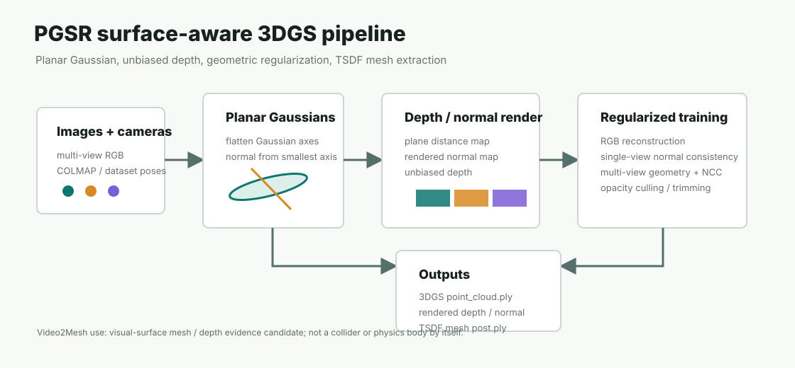

# PGSR

PGSR 全称是 **Planar-based Gaussian Splatting for Efficient and High-Fidelity Surface Reconstruction**。它不是一个语义模型，也不是一个直接可下载的通用预训练重建模型；它更像 GraphDECO 3DGS 的 surface-aware 训练分支：仍然用多视角 RGB 和相机优化一套 3D Gaussians，但把 Gaussian 压到更接近平面表面，并显式渲染 depth/normal，再用 TSDF 融合导出 mesh。



## 链接

- Project page: https://zju3dv.github.io/pgsr/
- Code: https://github.com/zju3dv/PGSR
- Paper: https://arxiv.org/abs/2406.06521
- Holi-Spatial code: https://github.com/Visionary-Laboratory/Holi-Spatial
- Local Holi-Spatial clone inspected: `/tmp/Holi-Spatial-official`
- Local PGSR wrapper inspected: `/tmp/Holi-Spatial-official/PGSR`

## 基本信息

| 项 | 内容 |
|---|---|
| 论文标题 | PGSR: Planar-based Gaussian Splatting for Efficient and High-Fidelity Surface Reconstruction |
| 作者 | Danpeng Chen, Hai Li, Weicai Ye, Yifan Wang, Weijian Xie, Shangjin Zhai, Nan Wang, Haomin Liu, Hujun Bao, Guofeng Zhang |
| 日期 | arXiv 2024-06-10 |
| 方法类型 | Surface reconstruction oriented 3D Gaussian Splatting |
| 输入 | posed multi-view RGB images，通常来自 COLMAP 或数据集相机 |
| 输出 | optimized Gaussian PLY、rendered RGB/depth/normal、TSDF mesh |
| 官方定位 | 不依赖预训练 depth/normal prior，从多视角 RGB 里做高保真表面重建 |
| 对 Video2Mesh 的定位 | P1/P2 surface-aware visual mesh / depth evidence 候选，不直接替代 P0 collider |

## 摘要要点

传统 GraphDECO 3DGS 很适合 novel-view rendering，但 Gaussian point cloud 本身是非结构化、各向异性的视觉表示。只靠 RGB reconstruction loss，Gaussian 可能为了渲染好看而拉长、漂浮或穿透真实表面；这就是为什么直接用 Gaussian center 做 Poisson/mesh/collider 往往会出现壳状伪影和飞片。

PGSR 的核心改动是把 Gaussian 当成局部平面来约束。它从 Gaussian 的最小轴估计 normal，把 splat 渲染为 plane distance / normal / depth，并加入 single-view normal consistency、multi-view geometric consistency 和 photometric NCC regularization。训练完成后，它不只是保存 3DGS PLY，还能渲染每个训练视角的 refined depth/normal，并用 Open3D TSDF fusion 把这些深度融合成 mesh。

所以 PGSR 对 Video2Mesh 的价值不是“有个现成模型直接出资产”，而是给当前 GraphDECO 视觉层增加一条更几何友好的训练路线：如果我们希望从 3DGS 得到更可靠的 surface mesh、mask lifting depth 或 object bbox evidence，PGSR 比 vanilla GraphDECO 更接近目标。

## 方法 Pipeline

| 阶段 | PGSR 做什么 | 关键输出 |
|---|---|---|
| 数据预处理 | 准备 multi-view images、camera intrinsics/extrinsics、初始 sparse/dense point cloud | COLMAP/NeRF-style scene directory |
| Gaussian 初始化 | 从点云初始化 Gaussian center、颜色、opacity、scale、rotation | 初始 3D Gaussians |
| Planar Gaussian 表示 | 用 Gaussian 最小轴作为局部 normal，把 Gaussian 压向局部平面 | normal-aware Gaussian field |
| Plane depth render | 渲染 plane distance、rendered normal、depth normal 和 unbiased depth | `plane_depth`, `rendered_normal`, `depth_normal` |
| RGB reconstruction | 和 3DGS 类似，用训练视角 RGB loss 保持外观质量 | photorealistic splats |
| Single-view geometry | 约束 rendered normal 与 depth-derived normal 一致 | 局部表面更平滑 |
| Multi-view geometry | 将当前视角 depth 回投到邻近视角，检查 depth consistency | 多视角几何更一致 |
| Multi-view photometric | 对邻近视角 patch 做 NCC/photometric consistency | 减少弱纹理/遮挡带来的错误 surface |
| Densify / prune / trim | 继续使用 3DGS 风格的增密、裁剪和 opacity culling | 更紧凑的 Gaussian PLY |
| TSDF mesh extraction | 对训练/测试视角渲染 depth，用 Open3D TSDF 融合三角网格 | `mesh/tsdf_fusion_post.ply` |

在官方代码里，训练端的关键逻辑集中在 `PGSR/train.py`：7000 iter 后开始 single-view normal loss 和 multi-view geo/photo loss；如果 camera 带 `depth_map`，代码也支持 depth L1 supervision。渲染端的关键逻辑在 `PGSR/render.py`：它保存 depth/normal 可视化，按 camera pose 把 rendered depth 融合进 `ScalableTSDFVolume`，最后写出 raw mesh 和 post-processed mesh。

## 几何生成路径

PGSR 生成几何的路径可以拆成三层：

| 层 | 产物 | 能做什么 | 不能直接做什么 |
|---|---|---|---|
| Gaussian PLY | `point_cloud/iteration_30000/point_cloud.ply` | visual proxy、novel-view rendering、semantic splat 辅助 | 不等于 watertight surface，不应直接当 collider |
| Rendered depth/normal | `renders_depth`, `renders_normal`, `plane_depth` | 2D mask 回投、bbox evidence、TSDF fusion 输入 | 不是人工真值，遮挡/反射/薄结构仍要过滤 |
| TSDF mesh | `mesh/tsdf_fusion.ply`, `mesh/tsdf_fusion_post.ply` | visual mesh、surface QA、object lifting 辅助 | 未经 QA 不适合作为物理碰撞体或仿真 body |

这和 Video2Mesh 当前的分层资产合同一致：3DGS/PGSR 是视觉和几何证据层，collider 仍然要单独走 COLMAP Delaunay、primitive proxy、convex decomposition 或手工 QA 后的 mesh route。PGSR mesh 如果要进入 simulator，需要额外检查尺度、坐标、连通分量、薄片、孔洞、法线、碰撞稳定性和物体分割。

## 官方结果摘录

官方 README 的 Code_V1.0 结果给了两个工程上有用的量级参考：

| Benchmark | 指标 | PGSR Code_V1.0 | 时间 |
|---|---|---:|---:|
| DTU | Chamfer Distance mean，越低越好 | 0.47 | 0.5h |
| Tanks and Temples | F1 mean，越高越好 | 0.51 | 45m |

这些数字只说明 PGSR 在官方数据和 protocol 下的 surface reconstruction 能力，不等于 Video2Mesh `bedroom_4` 的本地指标。本次任务是调研和文档发布，没有实际重训 PGSR，也没有为 `bedroom_4` 计算 Chamfer、F-score、PSNR、SSIM 或 LPIPS。

## 安装与硬件需求

官方 PGSR README 给出的基础环境是：

```bash
conda create -n pgsr python=3.8
conda activate pgsr
pip install torch torchvision torchaudio --index-url https://download.pytorch.org/whl/cu118
pip install -r requirements.txt
pip install submodules/diff-plane-rasterization
pip install submodules/simple-knn
```

工程上要注意三点：

| 项 | 说明 |
|---|---|
| CUDA 扩展 | `diff-plane-rasterization` 和 `simple-knn` 都要本机编译，Mac CPU 环境不适合跑完整训练 |
| GPU/VRAM | 官方没有写死最低 VRAM；参考 3DGS/PGSR 单场景训练，建议 16GB 以上，24GB RTX 3090 更稳 |
| 批量训练 | Holi-Spatial `3dgs_train.sh` 默认 `MAX_JOBS_PER_GPU=3`，对 24GB GPU 和高分辨率室内场景可能偏激进，正式跑前建议降到 1 |

对我们的机器判断：

| 机器 | 适合做什么 | 不适合做什么 |
|---|---|---|
| 本地 Mac | 读代码、写文档、准备数据、轻量检查 PLY/JSON | 编译 CUDA rasterizer、完整 PGSR 训练 |
| `mil8` 8 x RTX 3090 24GB | 单场景 PGSR、Holi-Spatial wrapper、mesh render、并行小批量实验 | 当前磁盘很紧时直接铺大数据集/全量 Holi-Spatial 批处理 |

## 有没有训好的模型

PGSR 本身不是“下载一个 checkpoint 后直接通用推理”的 feed-forward 模型。它的常规使用方式是 **每个场景单独训练/优化**：给定这一场景的 images 和 cameras，训练出该场景自己的 Gaussian PLY，再 render depth/normal/mesh。

因此官方 PGSR repo 主要发布的是代码、训练脚本和 benchmark protocol，不是像 DepthSplat/AnySplat 那种跨场景预训练权重。Holi-Spatial 里的 PGSR 也承担 per-scene geometry optimization；它输出的是每个 scene 的 trained 3DGS/PGSR assets，而不是一个可复用到任意视频的模型 checkpoint。

## 在 Holi-Spatial 中怎么用

Holi-Spatial 把 PGSR 放在几何优化链路里。它前面可以有 DA3 depth/pointcloud prior，后面接 mesh-guided mask、2D-to-3D lifting、3D bbox 和 spatial QA。

官方 clone 中与 PGSR 直接相关的入口是：

| 文件 | 作用 | 关键输出 |
|---|---|---|
| `3dgs_train.sh` | 批量训练 ScanNet v2 / ScanNet++ / DL3DV 风格场景的 PGSR/3DGS | `<OUTPUT_ROOT>/<scene>/point_cloud/iteration_30000/point_cloud.ply` |
| `mesh.sh` | 调用 `PGSR/render.py` 渲染 depth/normal 并做 TSDF mesh，随后用 mesh 生成 mask 过滤证据 | `<OUTPUT_ROOT>/<scene>/mesh/tsdf_fusion_post.ply` 和 scene `mask/` |
| `PGSR/train.py` | 单场景训练逻辑，RGB loss + single/multi-view geometry regularization | trained Gaussian model |
| `PGSR/render.py` | 输出 rendered depth/normal，并 Open3D TSDF fusion 成 mesh | `renders_depth`, `renders_normal`, `mesh/*.ply` |
| `PGSR/mesh2mask.py` | 用 mesh/depth 约束 mask 或过滤不可靠区域 | mesh-guided masks |

Holi-Spatial 的真实数据流可以理解成：

```text
scene images + cameras
  -> DA3 depth / point cloud prior
  -> PGSR per-scene optimization
  -> rendered refined depth + TSDF mesh
  -> SAM3 2D masks and VLM labels
  -> mask pixels back-projected by refined depth
  -> multi-view object bbox merge
  -> captions / 3D grounding / spatial QA
```

这里 PGSR 的作用是让 “2D mask -> 3D points -> bbox” 这一步的深度和表面更可靠。它不是 SAM3，也不负责识别物体类别；类别来自 VLM/SAM3 那条 perception 线。

## 在 Video2Mesh 中的位置

Video2Mesh 当前稳定主链路是：

```text
video frames
  -> COLMAP cameras / sparse / dense geometry
  -> GraphDECO 3DGS visual layer
  -> mesh / collider route
  -> semantic sidecars
  -> simulator asset bundle
```

PGSR 可以插入的位置更像 P1/P2 升级：

```text
frames + cameras
  -> PGSR surface-aware 3DGS
  -> rendered refined depth / normal
  -> TSDF visual mesh
  -> semantic mask lifting / bbox QA / visual mesh benchmark
```

| 能借用 | 价值 |
|---|---|
| PGSR 训练端 regularization | 减少 vanilla 3DGS 的拉丝、漂浮点和弱纹理表面错误 |
| Rendered depth/normal | 比直接用 Gaussian center 更适合 mask lifting、bbox 估计和 mesh fusion |
| TSDF mesh extraction | 给 SuGaR/2DGS/GOF 之外增加一条 visual mesh benchmark |
| Holi-Spatial wrapper | 已经把 ScanNet/ScanNet++/DL3DV 批处理和 mesh-to-mask 串起来，可参考目录合同 |

| 暂不直接接入 | 原因 |
|---|---|
| P0 collider 主链路 | PGSR mesh 仍需碰撞 QA，不能天然保证 watertight、低面数、稳定接触 |
| 全量 Holi-Spatial 批处理 | 依赖 DA3/SAM3/VLM/PGSR 多组件和大磁盘，不适合一口气塞进主 pipeline |
| 直接替换 GraphDECO | 当前 Video2Mesh 已有 GraphDECO 资产和 viewer 合同；PGSR 要先做同场景 A/B QA |

## 推荐实验路线

如果后续要正式评估 PGSR，建议按这个顺序做，避免又陷入“看起来能出 mesh，但不知道能不能用”的状态：

1. 用同一个 `bedroom_4` COLMAP source，训练 GraphDECO 30k 与 PGSR 30k。
2. 对比 viewer 截图、Gaussian PLY header、Gaussian count、bbox 范围和 floater 分布。
3. 用 PGSR render depth 做 TSDF mesh，记录 vertex/face count、连通分量、孔洞和薄片。
4. 与当前 COLMAP Delaunay collider、SuGaR/GS2Mesh visual mesh 做同视角对比。
5. 只在 mesh QA 通过后，才尝试把 PGSR mesh 降面/修补后作为 visual mesh 或 object mesh source；collider 仍保留单独验证。
6. 如果用于 Holi-Spatial-style QA，重点看 mask lifting 后的 3D bbox 是否更稳定，而不是只看 mesh 是否好看。

## 接入判断

- **短期 P0**：不进入主线；继续使用 GraphDECO 作为 visual layer，COLMAP/Delaunay 或已有 mesh route 做 collider。
- **P1**：作为 `bedroom_4` 单场景 A/B 实验候选，验证它是否能减少 3DGS floaters 并提高 mesh/depth 质量。
- **P2**：作为 Holi-Spatial-style 语义空间数据生成的几何后端，用于更可靠的 2D mask 回投、bbox、spatial QA。
- **风险**：CUDA 编译、训练耗时、磁盘占用、参数调节、TSDF mesh 的物理可用性都需要实测；不能只凭论文指标宣布可替换现有 Video2Mesh 主链路。
