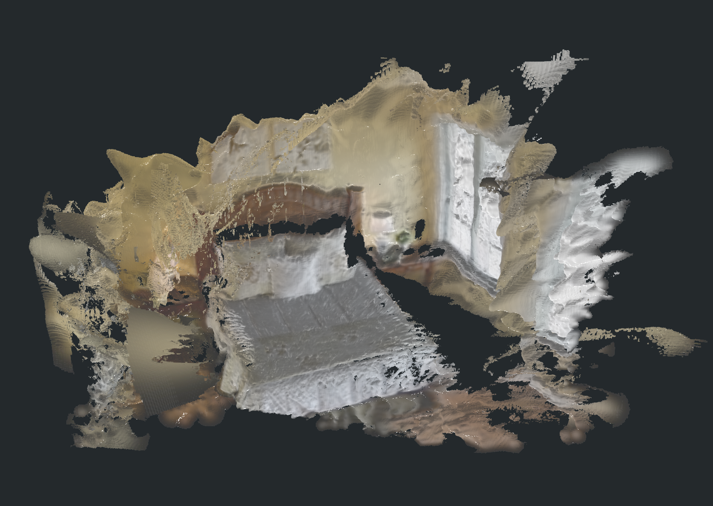

# PGSR 几何约束 3DGS

## 链接

- GitHub: https://github.com/zju3dv/PGSR
- Paper / project: PGSR, planar-based Gaussian Splatting reconstruction route
- 本地 smoke 资产：`/Users/zhangyuxiang/Desktop/worksplace/Video2Mesh_codex_dev/tmp_remote_results/bedroom_4_pgsr_smoke_20260711_025236/`
- 远端 smoke run：`/data/zyx/workspace/pgsr_runs/bedroom_4_pgsr_smoke_20260711_025236`

## 摘要要点

PGSR 可以理解为 GraphDECO 3DGS 的几何增强路线：仍然用 posed images 和 COLMAP 点云训练 Gaussian 场景，但在训练和渲染阶段引入 normal、depth、plane 或几何一致性相关约束，让 3D Gaussians 不只追求 photometric reconstruction，也尽量靠近可解释的场景表面。

这条线和 Video2Mesh 的关系很直接：如果 Gaussian 本身更贴近表面，那么后续用 rendered depth 做 TSDF fusion、或者把 visual layer 转成 visual mesh，会比直接拿普通 3DGS center point cloud 更有机会稳定。但 smoke 结果也说明，部署跑通不等于质量达标。`bedroom_4` 的 120 iter 快速测试已经验证代码路径和 mesh export 路径，但画面仍有明显漂浮、雾化和薄片伪影。

## Pipeline

| 阶段 | 作用 | 输出 |
|---|---|---|
| COLMAP 数据准备 | 用 Video2Mesh / COLMAP 相机、图像和点云组织成 PGSR 可读数据 | images、cameras、initial point cloud |
| PGSR training | 在 3DGS photometric loss 外加入几何项，优化 Gaussian 位置、颜色、opacity、scale、normal/plane evidence | `point_cloud.ply`、checkpoints、train metrics |
| render set | 从训练后 Gaussian 渲染 RGB、depth、normal | 多视角 rendered RGB/depth/normal |
| TSDF fusion | 用 rendered depth 融合三角网格 | `tsdf_fusion.ply` |
| mesh cleanup | 简单后处理、component 过滤和 mesh 清理 | `tsdf_fusion_post.ply` |

## 输入与输出

输入是 posed images、COLMAP camera 和初始点云；输出分两层：

- Gaussian visual layer：`point_cloud.ply`，包含位置、颜色、opacity、scale、rotation 等 3DGS 字段。
- Mesh candidate：由 PGSR rendered depth / normal 走 TSDF fusion 得到的 `tsdf_fusion.ply` 和后处理版 `tsdf_fusion_post.ply`。

注意：这些 mesh 更接近 visual mesh / geometry candidate，不应未经验证就拿去做碰撞、导航网格或 simulator physics body。

## bedroom_4 smoke 实测（2026-07-11）

这次是部署和链路 smoke test，不是完整 30k PGSR 训练，也不是 Holi-Spatial 官方全量复现。实验目标是确认 PGSR 能在 `mil8` 上安装、编译 CUDA extension、读取 `bedroom_4` 数据、训练出 Gaussian PLY，并导出 TSDF mesh。

| 项目 | 真实配置 / 指标 |
|---|---|
| 远端环境 | `mil8`，PGSR repo `/data/zyx/workspace/third_party/PGSR`，venv `/data/zyx/workspace/pgsr_env`，复用 `/opt/envs/max` 的 Torch 2.2.2 + CUDA 12.1 |
| 输入 | 80 张 `bedroom_4` 图像，采样 80,000 个真实 COLMAP 点 |
| 训练 | 120 iterations；保存 `iteration_60` 和 `iteration_120`；几何项日志中已出现 `Single / Geo / Pho` |
| smoke metric | iter 60: L1 0.1470 / train PSNR 16.37；iter 120: L1 0.1347 / train PSNR 17.70 |
| 渲染产物 | 80 张 RGB render、80 张 depth、80 张 normal |

`17.70 dB` 只是 120 iter train-view smoke 指标，不能当作 benchmark PSNR，也不能和完整 GraphDECO/PGSR 训练直接比较。

## 主要产物

| 产物 | 规模 | 本地路径 | 远端路径 | 视觉判断 |
|---|---:|---|---|---|
| Gaussian PLY | 97,381 vertices / 24,152,018 bytes | `tmp_remote_results/bedroom_4_pgsr_smoke_20260711_025236/full_assets/bedroom_4_pgsr_smoke_iter120_point_cloud.ply` | `output/point_cloud/iteration_120/point_cloud.ply` | 不太行：床、窗和部分家具轮廓可辨，但上半场景有大片黄褐色雾状 splats，右侧窗边和外侧有白色漂浮团，不能作为当前 visual layer 主资产。 |
| TSDF fusion post mesh | 903,694 vertices / 1,703,876 faces / 46,550,396 bytes | `tmp_remote_results/bedroom_4_pgsr_smoke_20260711_025236/full_assets/bedroom_4_pgsr_smoke_tsdf_fusion_post.ply` | `output/mesh/tsdf_fusion_post.ply` | 一般般：床和窗的大结构保住了，后处理去掉了一部分碎片，但墙面、窗边、床边仍有薄片、粘连、破洞和漂浮面。 |
| TSDF fusion raw mesh | 1,091,652 vertices / 1,975,303 faces / 55,153,814 bytes | `tmp_remote_results/bedroom_4_pgsr_smoke_20260711_025236/full_assets/bedroom_4_pgsr_smoke_tsdf_fusion_raw.ply` | `output/mesh/tsdf_fusion.ply` | 一般般：比 post 版本保留更多碎片和外侧漂浮面，细节更多但噪声也更多；保真度提高不等于可用度提高。 |

### 截图证据

## 效果分析

这次结果的正面意义是：PGSR 环境、训练、render、depth/normal 输出和 TSDF mesh export 都跑通了；几何项也确实进入训练日志，说明不是只跑了普通 3DGS fallback。

问题同样明显：

- 120 iter 远低于 PGSR/3DGS 常规收敛迭代数，Gaussian 还处在粗糙覆盖阶段。
- 初始点云只采样了 80,000 个 COLMAP 点，足够 smoke，但不足以支撑稳定 room-scale 表面。
- TSDF fusion 消费的是早期 rendered depth；depth 里一旦有雾状 Gaussian 或漂浮块，mesh 就会变成薄片、粘连和外侧碎片。
- 后处理版 `tsdf_fusion_post.ply` 能减少一部分小碎片，但没有解决窗边、墙面和床边的系统性噪声。

## 在 Video2Mesh 中的位置

PGSR 暂时应放在 P1/P2 的 geometry-aware 3DGS 候选路线，而不是替换当前 GraphDECO + COLMAP Delaunay 主链路。当前结论：

- 可以保留 PGSR 作为后续 high-quality visual mesh / surface-aware Gaussian benchmark。
- 不应把这次 `bedroom_4` 120 iter smoke 的 Gaussian PLY 当作最终 visual layer。
- 不应把 `tsdf_fusion_raw/post.ply` 直接当作 collider、navigation mesh 或 simulator physics body。
- 下一步如果继续投入，应跑更接近完整设置的训练迭代，并系统调 `voxel_size`、`max_depth`、depth filtering、component cleanup，再和 GraphDECO 30k、GS2Mesh、COLMAP Delaunay 做同场景对比。

## 接入判断

- P0：不接入主流程。
- P1：可作为 geometry-aware 3DGS 对照实验，重点观察 rendered depth 是否比普通 3DGS 更适合 fusion。
- P2：若完整训练能显著降低漂浮和薄片伪影，再考虑用于 visual mesh candidate。
- 风险：PGSR 跑通容易被误读成“mesh 已可用”；文档和实验记录必须继续区分 smoke、完整训练、visual layer、visual mesh 和 collider。
