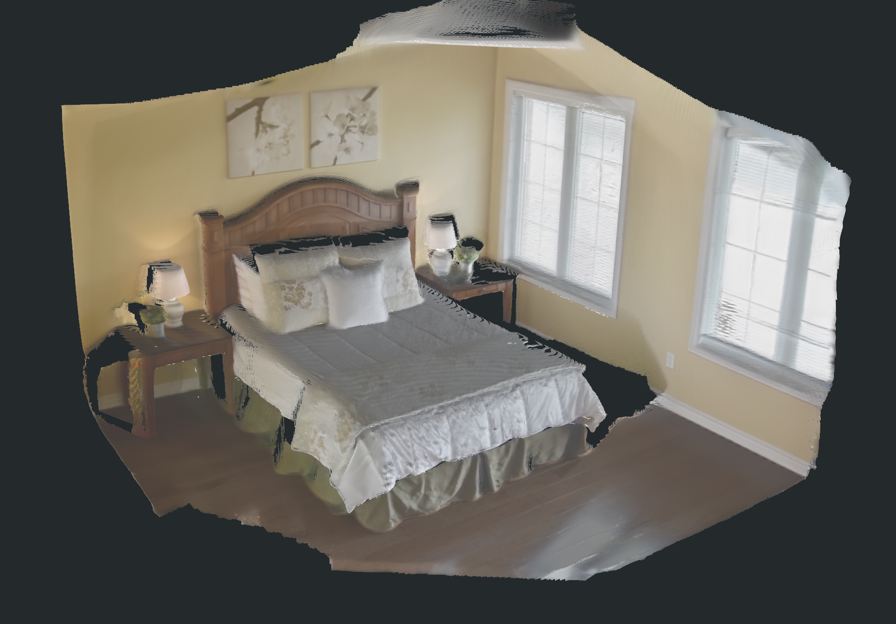
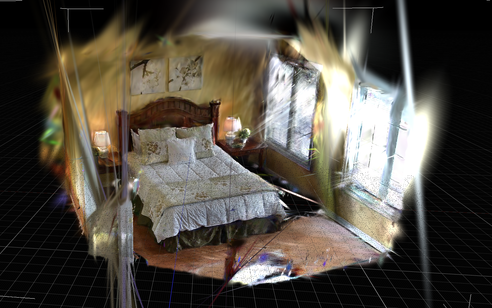

# PGSR：面向表面的 Gaussian Splatting 与 bedroom_4 实测

本页只保留 `2026-07-14` 的 `bedroom_4_fresh_da3_sam3_pgsr_20260714_184217` 30k 结果。此前 120-iteration smoke 和其他旧 PGSR 实验输出均已清理，不再作为质量或部署结论。

## 链接

- Paper / project: https://github.com/zju3dv/PGSR
- Holi-Spatial pipeline: https://github.com/Visionary-Laboratory/Holi-Spatial
- 当前实验报告：[Holi-Spatial bedroom_4 全链路重跑](../../experiments/holi-spatial-bedroom4-fresh-run-20260714.md)

## 摘要要点

PGSR 是面向表面重建的 per-scene Gaussian Splatting 方法。它并非通用预训练视频到 3D 模型：每个 scene 都需要利用图像、相机和初始化几何进行优化，输出该场景的 Gaussians、rendered depth/normal 和 TSDF mesh。它的价值在于为视觉 3DGS 与显式 mesh 之间提供一条 surface-aware 路线。

## 方法 Pipeline

```text
images + calibrated cameras + initialization points/depth
  -> Gaussian optimization with geometric regularization
  -> rendered RGB / depth / normal
  -> TSDF fusion and postprocess
  -> scene mesh for geometric inspection
```

| 阶段 | 输入 | 输出 | 作用 |
|---|---|---|---|
| 初始化 | images、cameras、DA3/point prior | initial Gaussians | 把场景放入统一多视图坐标 |
| PGSR optimization | Gaussians、图像监督、几何项 | optimized Gaussian PLY | 提高场景视觉与几何一致性 |
| render | optimized model | RGB、depth、normal | 给 TSDF 和 mask lifting 提供视图一致的几何证据 |
| TSDF fusion | rendered depth | mesh | 从 Gaussian 视觉层导出显式场景表面 |

## 在 Holi-Spatial 中的角色

Holi-Spatial 使用 PGSR/3DGS 作为 DA3 之后的 per-scene geometry optimization。SAM3 只给出 2D masks；更一致的 depth、mesh 和 Gaussian centers 才能支持后续 2D-to-3D lifting、bbox 和 semantic Gaussian projection。PGSR 仍不是语义模型、实例分割模型或 collider 生成器。

## bedroom_4 fresh 30k 实测

| 项 | 结果 |
|---|---|
| 远端 run | `mil8:/data/design/zyx/workspace/holi_spatial_runs/bedroom_4_fresh_da3_sam3_pgsr_20260714_184217` |
| 输入 | 80 帧 `bedroom_4`、校正相机、DA3 point/depth prior |
| 训练 | 官方 PGSR 至 iteration 30,000 |
| 最终日志 | L1 `0.0118202`、PSNR `33.1155 dB`、missing-depth warning `0` |
| 原始 Gaussian | 871,317 vertices，206.1 MiB binary PLY |
| TSDF post mesh | 694,773 vertices / 1,351,454 faces，34.6 MiB |
| 语义后续 | SAM3 2D masks 直接投影到 PGSR Gaussians，701,608 selected Gaussians |





### 质量判断

- TSDF mesh 的床、墙、窗和地面连续，是本次最强的表面化输出，适合几何检查与后续 visual mesh 对照。
- 原始 30k Gaussian 的主体空洞基本修复，但窗边、场景外缘和未充分观测区仍可见长条 splat、floaters 和放射状伪影。
- 训练日志中的 PSNR/L1 是同场景 train-view evaluation，不是 ScanNet benchmark，也不能证明 collider 或物理可用性。

## 硬件与环境

PGSR 需要 CUDA PyTorch 和 `diff-plane-rasterization`、`simple-knn` 等 CUDA 扩展。本次在 `mil8` 的 8 张 RTX 3090 24GB 环境完成单场景训练。全量 Holi-Spatial 批处理还会叠加 DA3、SAM3、VLM 和输出存储成本，单场景通过不能直接外推为批量吞吐。

## 接入判断

- 可作为 Video2Mesh P1/P2 的高质量 visual mesh / depth backend 候选。
- 不应直接替换 COLMAP Delaunay collider：尚未做 watertightness、尺度、碰撞或接触 QA。
- semantic 3DGS 需要单独写入 `object_id/object_probability`，而不是假定 PGSR 原生带语义。
- 下一步优先做 Gaussian elongation / floater 过滤和 TSDF mesh 碰撞可用性验证。
